# 数据流设计

<cite>
**本文档引用的文件**
- [src/App.tsx](file://src/App.tsx)
- [src/context/AppContext.tsx](file://src/context/AppContext.tsx)
- [src/types/index.ts](file://src/types/index.ts)
- [src/utils/aiRecommend.ts](file://src/utils/aiRecommend.ts)
- [src/pages/PlannerPage.tsx](file://src/pages/PlannerPage.tsx)
- [src/components/AttractionsPanel.tsx](file://src/components/AttractionsPanel.tsx)
- [src/components/DayTimeline.tsx](file://src/components/DayTimeline.tsx)
- [server/index.ts](file://server/index.ts)
- [server/db.ts](file://server/db.ts)
- [server/qwen.ts](file://server/qwen.ts)
- [agent/index.ts](file://agent/index.ts)
- [agent/db.ts](file://agent/db.ts)
- [agent/sources/ai.ts](file://agent/sources/ai.ts)
- [api/index.ts](file://api/index.ts)
- [package.json](file://package.json)
</cite>

## 目录
1. [引言](#引言)
2. [项目结构](#项目结构)
3. [核心组件](#核心组件)
4. [架构概览](#架构概览)
5. [详细组件分析](#详细组件分析)
6. [依赖关系分析](#依赖关系分析)
7. [性能考虑](#性能考虑)
8. [故障排除指南](#故障排除指南)
9. [结论](#结论)

## 引言

本文件为旅行规划Demo项目的详细数据流设计文档，全面阐述从用户输入到最终展示的完整数据流程。系统采用前后端分离架构，前端基于React构建，后端基于Express + SQLite，AI数据采集通过独立的Agent工具实现。

系统的核心数据流包括四个主要层面：
- 用户界面交互与状态管理
- 前端状态管理架构（AppContext全局状态、React Hooks使用）
- AI数据采集与处理（POI搜索、数据清洗、质量评估）
- 后端API数据处理（请求路由、数据库操作、响应返回）

## 项目结构

该项目采用模块化组织方式，主要分为以下几个核心模块：

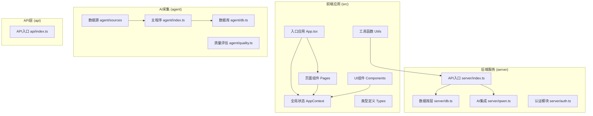

**图表来源**
- [src/App.tsx:1-62](file://src/App.tsx#L1-L62)
- [server/index.ts:1-28](file://server/index.ts#L1-L28)
- [agent/index.ts:1-800](file://agent/index.ts#L1-L800)

**章节来源**
- [package.json:1-59](file://package.json#L1-L59)
- [src/App.tsx:1-62](file://src/App.tsx#L1-L62)
- [server/index.ts:1-28](file://server/index.ts#L1-L28)

## 核心组件

### 前端状态管理系统

前端采用React Context + useReducer的组合模式实现全局状态管理：

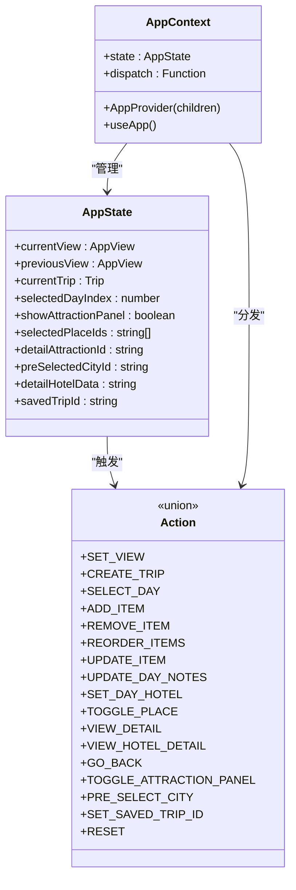

**图表来源**
- [src/context/AppContext.tsx:4-42](file://src/context/AppContext.tsx#L4-L42)
- [src/context/AppContext.tsx:215-233](file://src/context/AppContext.tsx#L215-L233)

### 数据模型架构

系统定义了完整的数据模型体系，涵盖旅行规划的各个方面：

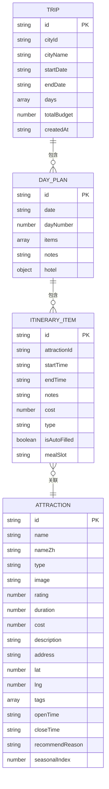

**图表来源**
- [src/types/index.ts:125-134](file://src/types/index.ts#L125-L134)
- [src/types/index.ts:116-123](file://src/types/index.ts#L116-L123)
- [src/types/index.ts:102-114](file://src/types/index.ts#L102-L114)
- [src/types/index.ts:77-100](file://src/types/index.ts#L77-L100)

**章节来源**
- [src/context/AppContext.tsx:1-234](file://src/context/AppContext.tsx#L1-L234)
- [src/types/index.ts:1-239](file://src/types/index.ts#L1-L239)

## 架构概览

系统采用三层架构设计，实现了清晰的职责分离：

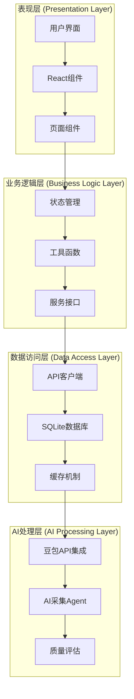

**图表来源**
- [src/utils/aiRecommend.ts:1-251](file://src/utils/aiRecommend.ts#L1-L251)
- [server/index.ts:1-790](file://server/index.ts#L1-L790)
- [agent/index.ts:1-800](file://agent/index.ts#L1-L800)

## 详细组件分析

### 前端数据流处理

#### 用户界面交互到状态管理

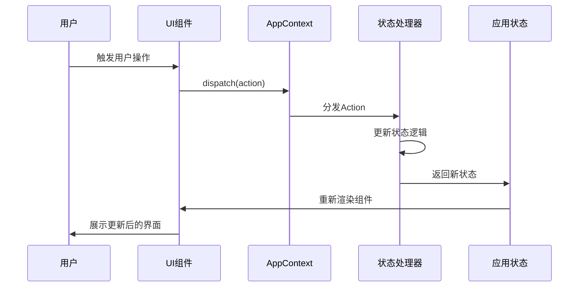

**图表来源**
- [src/context/AppContext.tsx:83-212](file://src/context/AppContext.tsx#L83-L212)
- [src/App.tsx:17-48](file://src/App.tsx#L17-L48)

#### POI数据获取流程

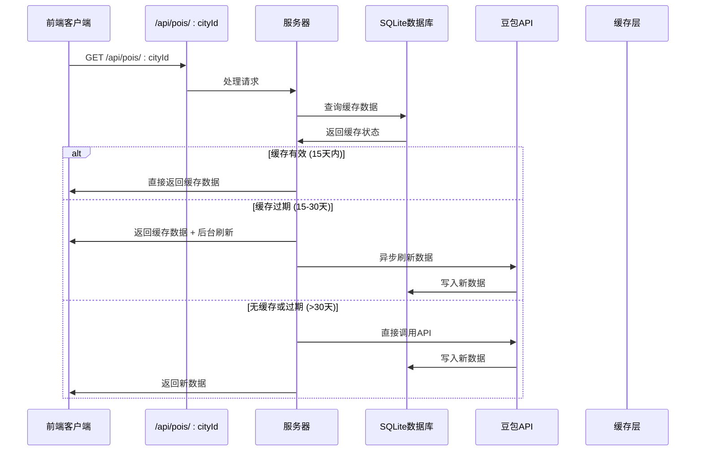

**图表来源**
- [server/index.ts:108-144](file://server/index.ts#L108-L144)
- [server/qwen.ts:361-485](file://server/qwen.ts#L361-L485)

**章节来源**
- [src/utils/aiRecommend.ts:44-94](file://src/utils/aiRecommend.ts#L44-L94)
- [src/pages/PlannerPage.tsx:26-52](file://src/pages/PlannerPage.tsx#L26-L52)

### AI数据采集系统

#### Agent数据采集流程

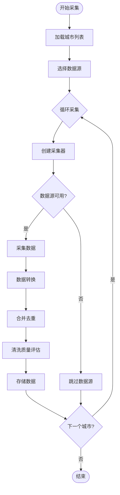

**图表来源**
- [agent/index.ts:134-281](file://agent/index.ts#L134-L281)
- [agent/index.ts:285-366](file://agent/index.ts#L285-L366)

#### AI数据源处理

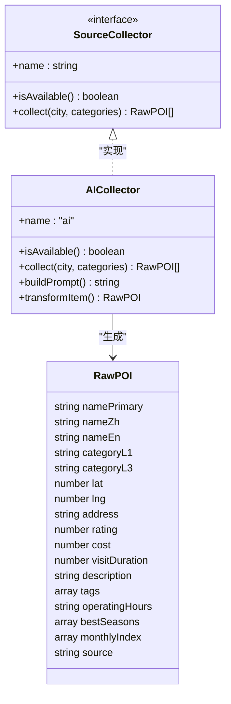

**图表来源**
- [agent/sources/ai.ts:246-341](file://agent/sources/ai.ts#L246-L341)
- [agent/sources/ai.ts:168-203](file://agent/sources/ai.ts#L168-L203)

**章节来源**
- [agent/index.ts:1-800](file://agent/index.ts#L1-L800)
- [agent/sources/ai.ts:1-342](file://agent/sources/ai.ts#L1-L342)

### 后端API处理流程

#### 旅行行程管理API

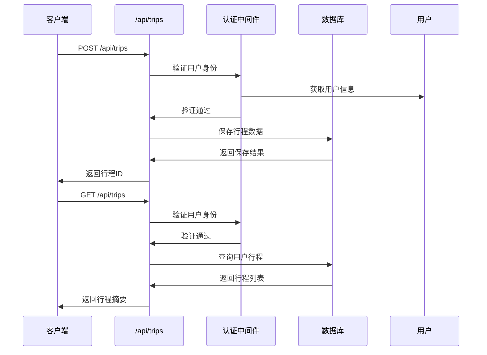

**图表来源**
- [server/index.ts:413-436](file://server/index.ts#L413-L436)
- [server/index.ts:438-486](file://server/index.ts#L438-L486)

#### 微游记功能流程

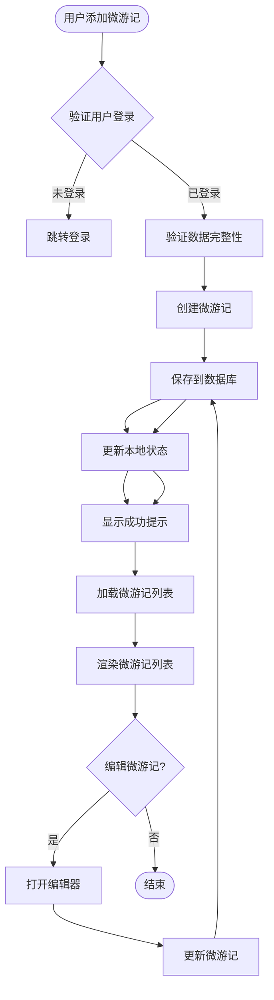

**图表来源**
- [src/components/DayTimeline.tsx:144-220](file://src/components/DayTimeline.tsx#L144-L220)
- [server/index.ts:695-751](file://server/index.ts#L695-L751)

**章节来源**
- [server/index.ts:1-790](file://server/index.ts#L1-L790)
- [src/components/DayTimeline.tsx:1-979](file://src/components/DayTimeline.tsx#L1-L979)

## 依赖关系分析

### 技术栈依赖

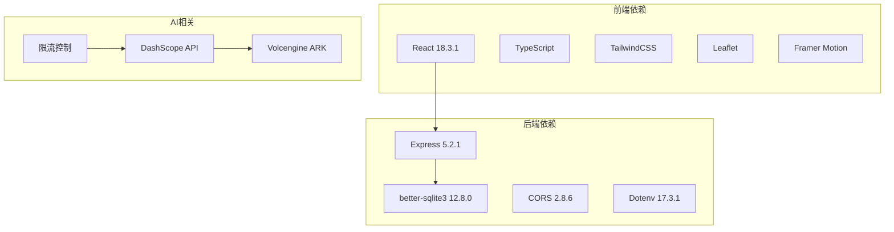

**图表来源**
- [package.json:26-59](file://package.json#L26-L59)

### 组件间数据依赖

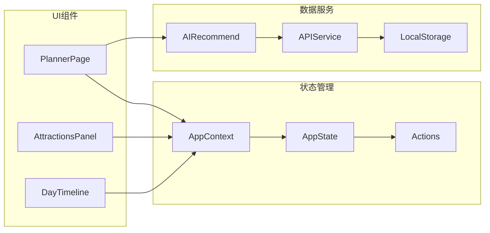

**图表来源**
- [src/context/AppContext.tsx:1-234](file://src/context/AppContext.tsx#L1-L234)
- [src/utils/aiRecommend.ts:1-251](file://src/utils/aiRecommend.ts#L1-L251)

**章节来源**
- [package.json:1-59](file://package.json#L1-L59)

## 性能考虑

### 缓存策略

系统实现了多层次的缓存机制：

1. **前端缓存**：React组件级别的状态缓存
2. **服务器缓存**：SQLite数据库缓存POI数据
3. **AI缓存**：Agent工具的本地数据库缓存
4. **浏览器缓存**：静态资源缓存

### 性能优化措施

- **并发控制**：Agent工具支持并发数据采集
- **智能去重**：AI数据采集时的重复数据检测
- **懒加载**：图片和组件的延迟加载
- **虚拟滚动**：大量POI列表的性能优化

## 故障排除指南

### 常见问题及解决方案

#### API调用失败

**问题症状**：前端无法获取POI数据
**可能原因**：
- API密钥配置错误
- 网络连接问题
- 服务器超时

**解决步骤**：
1. 检查环境变量配置
2. 验证网络连接
3. 查看服务器日志

#### 数据同步问题

**问题症状**：前端显示数据与实际不符
**可能原因**：
- 缓存数据过期
- 状态管理异常
- 数据库连接问题

**解决步骤**：
1. 清除浏览器缓存
2. 重启应用服务
3. 检查数据库状态

#### AI数据质量

**问题症状**：AI生成的POI质量不高
**可能原因**：
- Prompt设计问题
- 数据源质量不佳
- 限流导致的数据不足

**解决步骤**：
1. 调整AI Prompt参数
2. 增加数据源多样性
3. 优化限流策略

**章节来源**
- [server/index.ts:136-143](file://server/index.ts#L136-L143)
- [agent/index.ts:538-639](file://agent/index.ts#L538-L639)

## 结论

本旅行规划Demo项目展现了完整的数据流设计架构，通过前后端分离、AI数据采集、智能缓存等技术手段，实现了高效、可扩展的旅行规划系统。系统的关键优势包括：

1. **清晰的架构分层**：前端状态管理、后端API服务、AI数据采集各司其职
2. **完善的缓存机制**：多层次缓存确保系统性能
3. **灵活的状态管理**：基于React Context的状态管理模式
4. **强大的AI集成**：多种数据源的AI生成能力
5. **良好的扩展性**：模块化设计便于功能扩展

该系统为类似旅行规划应用提供了完整的参考架构，开发者可以根据具体需求进行定制和扩展。