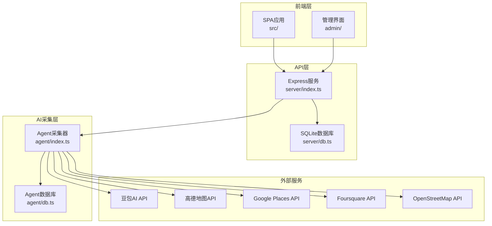
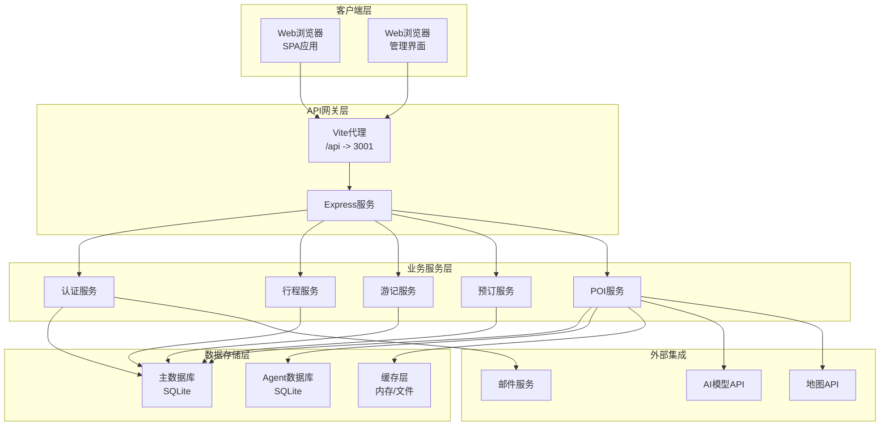
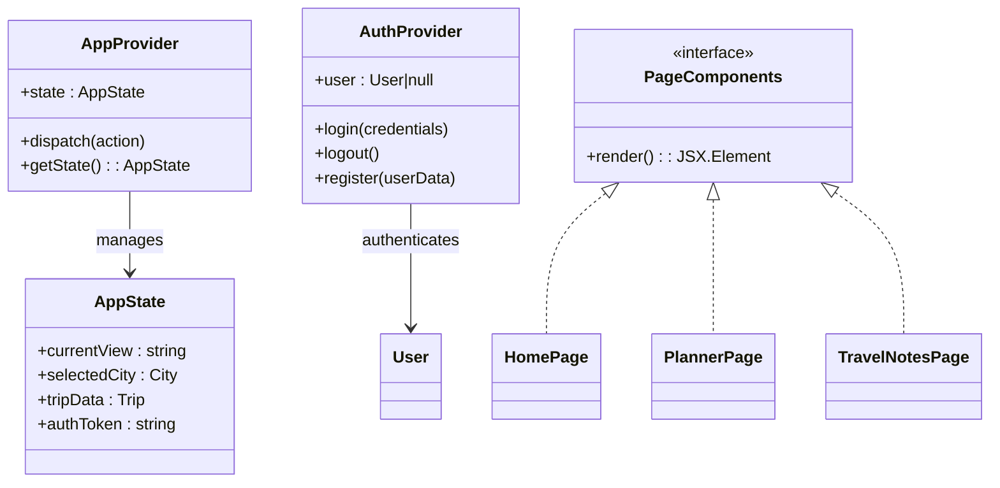
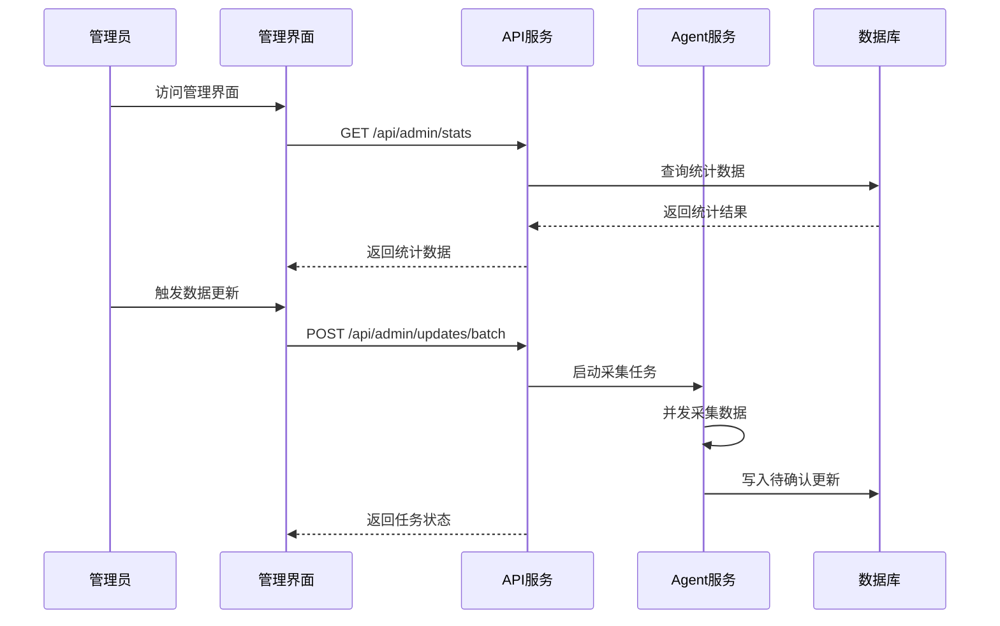
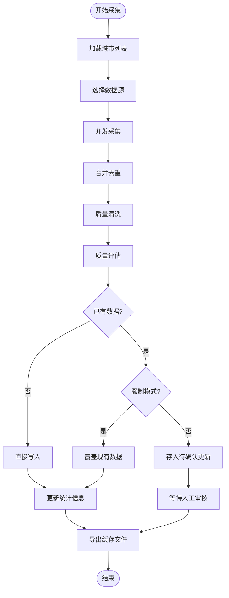
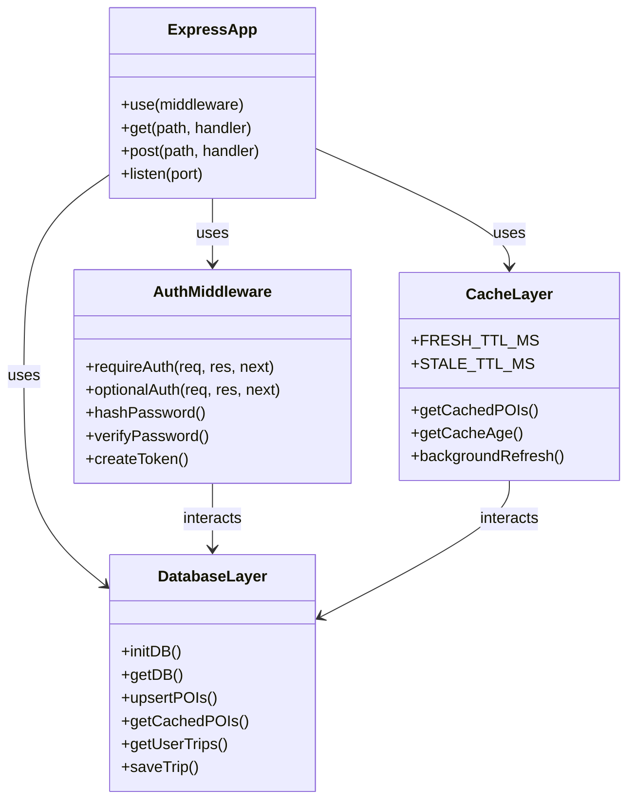
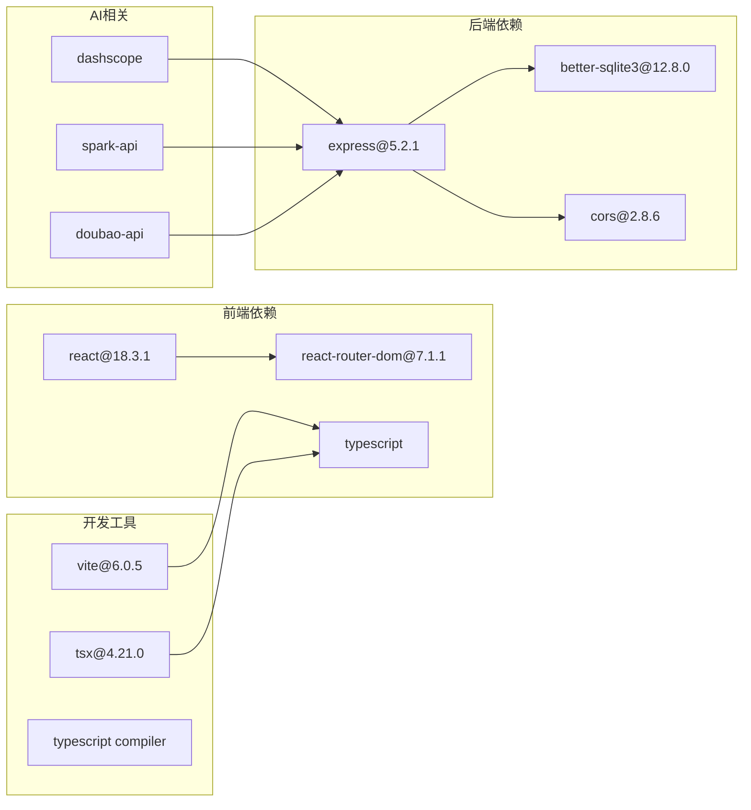

# 整体架构概览

<cite>
**本文档引用的文件**
- [package.json](file://package.json)
- [vite.config.ts](file://vite.config.ts)
- [server/index.ts](file://server/index.ts)
- [src/main.tsx](file://src/main.tsx)
- [admin/main.tsx](file://admin/main.tsx)
- [src/App.tsx](file://src/App.tsx)
- [admin/App.tsx](file://admin/App.tsx)
- [server/db.ts](file://server/db.ts)
- [agent/db.ts](file://agent/db.ts)
- [agent/index.ts](file://agent/index.ts)
- [server/admin-routes.ts](file://server/admin-routes.ts)
- [agent/config.ts](file://agent/config.ts)
- [index.html](file://index.html)
- [admin.html](file://admin.html)
</cite>

## 目录
1. [引言](#引言)
2. [项目结构](#项目结构)
3. [核心组件](#核心组件)
4. [架构总览](#架构总览)
5. [详细组件分析](#详细组件分析)
6. [依赖关系分析](#依赖关系分析)
7. [性能考虑](#性能考虑)
8. [故障排除指南](#故障排除指南)
9. [结论](#结论)

## 引言
本项目是一个旅行规划Demo，采用四层架构设计：
- 前端SPA应用层：React + Vite 构建的单页应用，提供用户交互界面
- 后台管理系统层：独立的React管理界面，用于数据治理和发布
- AI数据采集层：独立的Agent程序，负责从多源API采集、清洗、合并POI数据
- API服务层：基于Express.js的后端服务，提供REST接口和缓存策略

系统采用前后端分离架构，通过Vite开发服务器代理API请求，实现开发期的无缝联调。

## 项目结构
项目采用模块化组织，主要目录结构如下：
- `/src`：前端SPA应用源码，包含页面组件、业务逻辑、UI组件
- `/admin`：后台管理系统源码，独立的React应用
- `/server`：Express后端服务，包含数据库操作、认证、API路由
- `/agent`：AI数据采集Agent，独立CLI工具，负责POI数据采集和处理
- `/scripts`：部署和运维脚本
- `/public`：静态资源

**图表来源**
- [server/index.ts:1-790](file://server/index.ts#L1-L790)
- [agent/index.ts:1-1132](file://agent/index.ts#L1-L1132)
- [server/db.ts:1-513](file://server/db.ts#L1-L513)
- [agent/db.ts:1-459](file://agent/db.ts#L1-L459)

**章节来源**
- [package.json:1-59](file://package.json#L1-L59)
- [vite.config.ts:1-46](file://vite.config.ts#L1-L46)

## 核心组件
系统由四个核心组件构成，每个组件都有明确的职责边界：

### 前端SPA应用层
- **技术栈**：React 18 + TypeScript + TailwindCSS + Framer Motion
- **构建工具**：Vite 6，支持热重载和快速开发
- **路由管理**：React Router DOM 7，基于AppProvider的状态驱动视图切换
- **核心功能**：旅行规划、景点浏览、行程管理、游记分享

### 后台管理系统层
- **技术栈**：独立的React应用，使用HashRouter实现SPA
- **管理范围**：POI数据管理、城市维护、更新审核、发布控制
- **集成方式**：通过代理访问API服务，实现统一的管理界面

### AI数据采集层
- **技术栈**：Node.js + TypeScript + better-sqlite3
- **数据源**：高德、Google、Foursquare、OpenStreetMap、AI模型等
- **核心能力**：并发采集、数据合并、质量评估、增量更新
- **存储**：独立的SQLite数据库，支持待确认更新队列

### API服务层
- **技术栈**：Express.js + better-sqlite3 + CORS中间件
- **缓存策略**：三层缓存（内存/文件/数据库），支持异步刷新
- **认证机制**：JWT令牌，支持邮箱验证和密码重置
- **数据模型**：用户、行程、评论、预订、微游记等

**章节来源**
- [src/App.tsx:1-62](file://src/App.tsx#L1-L62)
- [admin/App.tsx:1-27](file://admin/App.tsx#L1-L27)
- [server/index.ts:1-790](file://server/index.ts#L1-L790)
- [agent/index.ts:1-1132](file://agent/index.ts#L1-L1132)

## 架构总览
系统采用分层微服务架构，通过清晰的边界实现松耦合：

**图表来源**
- [vite.config.ts:36-44](file://vite.config.ts#L36-L44)
- [server/index.ts:29-790](file://server/index.ts#L29-L790)
- [server/db.ts:1-513](file://server/db.ts#L1-L513)
- [agent/db.ts:1-459](file://agent/db.ts#L1-L459)

## 详细组件分析

### 前端SPA应用架构
前端采用React Hooks和Context模式实现状态管理：

**图表来源**
- [src/App.tsx:1-62](file://src/App.tsx#L1-L62)
- [src/main.tsx:1-10](file://src/main.tsx#L1-L10)

前端路由采用基于状态的视图切换模式，通过AppProvider的state.currentView控制当前显示的页面组件。

**章节来源**
- [src/App.tsx:17-48](file://src/App.tsx#L17-L48)
- [src/main.tsx:1-10](file://src/main.tsx#L1-L10)

### 后台管理系统架构
管理界面采用独立的React应用，使用HashRouter避免服务器路由冲突：

**图表来源**
- [admin/App.tsx:1-27](file://admin/App.tsx#L1-L27)
- [server/admin-routes.ts:1-200](file://server/admin-routes.ts#L1-L200)

**章节来源**
- [admin/App.tsx:11-26](file://admin/App.tsx#L11-L26)
- [admin/main.tsx:1-14](file://admin/main.tsx#L1-L14)

### AI数据采集系统
Agent系统实现了完整的数据采集生命周期：

**图表来源**
- [agent/index.ts:134-281](file://agent/index.ts#L134-L281)
- [agent/index.ts:285-366](file://agent/index.ts#L285-L366)

**章节来源**
- [agent/index.ts:1-1132](file://agent/index.ts#L1-L1132)
- [agent/config.ts:1-182](file://agent/config.ts#L1-L182)

### API服务架构
后端服务采用Express框架，实现了完整的REST API：

**图表来源**
- [server/index.ts:29-790](file://server/index.ts#L29-L790)
- [server/db.ts:37-147](file://server/db.ts#L37-L147)

**章节来源**
- [server/index.ts:108-160](file://server/index.ts#L108-L160)
- [server/db.ts:1-200](file://server/db.ts#L1-L200)

## 依赖关系分析

**图表来源**
- [package.json:26-57](file://package.json#L26-L57)

系统采用模块化的依赖管理，前端和后端分别维护独立的依赖树，通过清晰的边界实现解耦。

**章节来源**
- [package.json:1-59](file://package.json#L1-L59)

## 性能考虑
系统在多个层面实现了性能优化：

### 缓存策略
- **三层缓存**：内存缓存 + 文件缓存 + 数据库缓存
- **智能刷新**：过期检测和异步刷新机制
- **季节性数据**：支持按季度缓存不同POI数据

### 并发控制
- **Agent并发**：可配置的城市并发数量
- **API限流**：各数据源的请求间隔控制
- **超时管理**：合理的超时设置避免阻塞

### 数据库优化
- **WAL模式**：提高并发读写的性能
- **索引优化**：关键查询字段建立索引
- **连接池**：合理管理数据库连接

## 故障排除指南

### 常见问题诊断
1. **API服务启动失败**
   - 检查端口占用：默认3001端口
   - 验证数据库权限：确保DB_DIR可写
   - 确认API密钥配置

2. **Agent采集异常**
   - 检查数据源API Key配置
   - 验证网络连通性
   - 查看Agent日志输出

3. **前端开发问题**
   - 确认Vite代理配置正确
   - 检查CORS设置
   - 验证TypeScript编译

### 性能监控
- **缓存命中率**：监控缓存使用效率
- **API响应时间**：跟踪各接口性能
- **数据库查询**：分析慢查询日志

**章节来源**
- [server/index.ts:778-787](file://server/index.ts#L778-L787)
- [agent/index.ts:538-639](file://agent/index.ts#L538-L639)

## 结论
本项目成功实现了四层架构的旅行规划系统，具有以下特点：

### 架构优势
- **清晰的职责分离**：前端、后端、AI采集、管理界面各司其职
- **灵活的扩展性**：模块化设计便于功能扩展
- **可靠的稳定性**：多层缓存和错误处理机制

### 技术选型合理性
- **前端**：React + Vite提供了优秀的开发体验
- **后端**：Express + SQLite适合中小型应用
- **AI采集**：独立Agent确保数据质量
- **部署**：支持多种部署方式，便于运维

### 设计原则
- **单一职责**：每个组件专注于特定领域
- **开闭原则**：对扩展开放，对修改封闭
- **依赖倒置**：高层模块不依赖低层模块
- **接口隔离**：小而专一的接口设计

该架构为旅行规划应用提供了一个完整、可扩展的技术解决方案，既满足了演示需求，又具备实际部署价值。