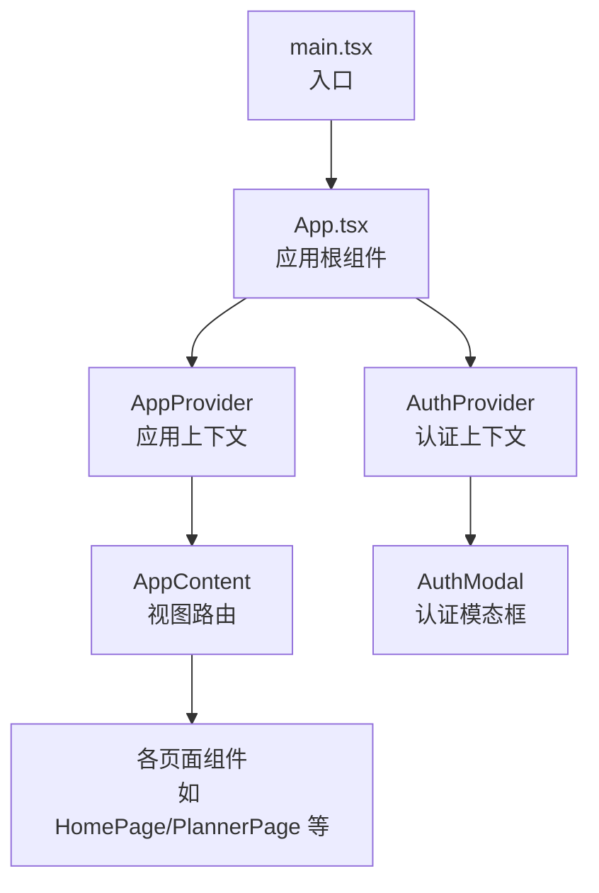
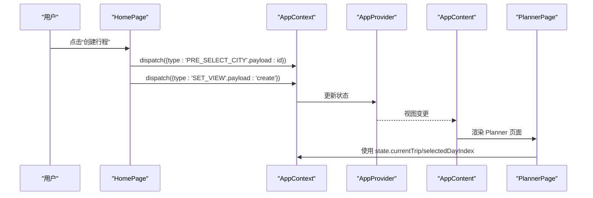
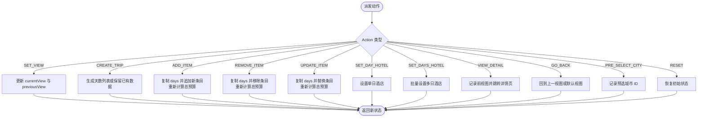
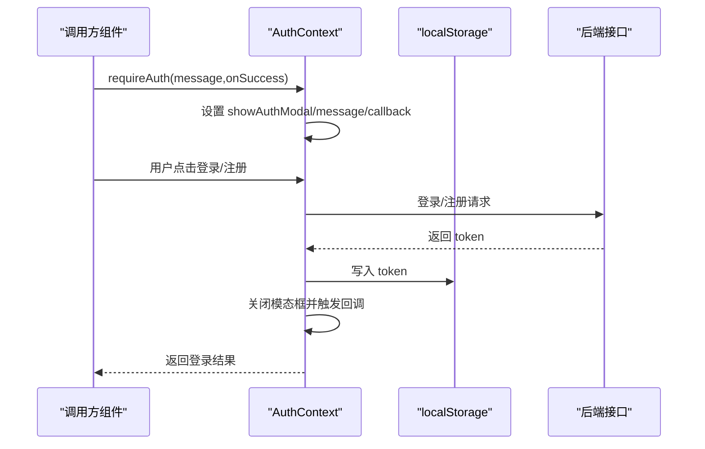
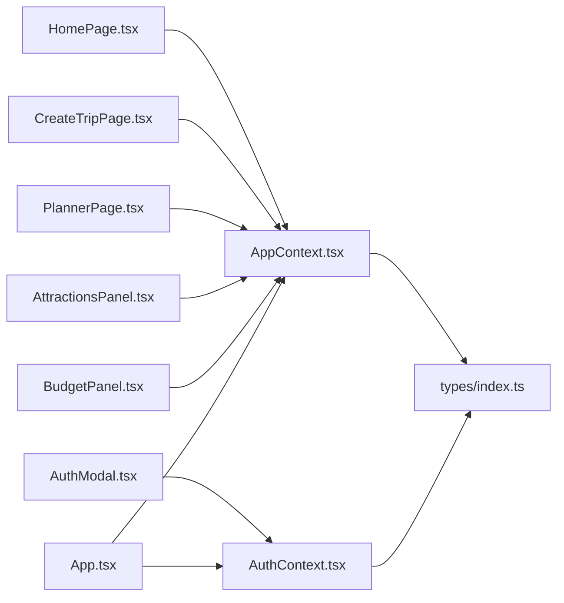

# 状态管理架构

<cite>
**本文引用的文件**
- [AppContext.tsx](file://src/context/AppContext.tsx)
- [AuthContext.tsx](file://src/context/AuthContext.tsx)
- [App.tsx](file://src/App.tsx)
- [AuthModal.tsx](file://src/components/AuthModal.tsx)
- [index.ts](file://src/types/index.ts)
- [HomePage.tsx](file://src/pages/HomePage.tsx)
- [CreateTripPage.tsx](file://src/pages/CreateTripPage.tsx)
- [PlannerPage.tsx](file://src/pages/PlannerPage.tsx)
- [AttractionsPanel.tsx](file://src/components/AttractionsPanel.tsx)
- [BudgetPanel.tsx](file://src/components/BudgetPanel.tsx)
- [main.tsx](file://src/main.tsx)
</cite>

## 目录
1. [简介](#简介)
2. [项目结构](#项目结构)
3. [核心组件](#核心组件)
4. [架构总览](#架构总览)
5. [详细组件分析](#详细组件分析)
6. [依赖关系分析](#依赖关系分析)
7. [性能考量](#性能考量)
8. [故障排查指南](#故障排查指南)
9. [结论](#结论)
10. [附录](#附录)

## 简介
本项目采用 React Context 模式实现全局状态管理，通过两个上下文分别管理旅行计划状态与用户认证状态：
- AppContext：集中管理旅行计划相关状态（当前视图、行程数据、选中日期、详情页数据等），并提供统一的 reducer 分发机制。
- AuthContext：集中管理用户认证状态（登录态、令牌、模态框显示与回调），并提供登录/注册/登出等能力。

该架构遵循“状态提升”与“状态下沉”的设计原则，避免过度共享状态，确保状态更新可追踪、副作用可控，并提供清晰的状态流转图与最佳实践。

## 项目结构
前端入口在 main.tsx 中挂载 App，App 组合了 AppProvider 与 AuthProvider，形成双重 Provider 包裹，使所有子组件可通过 useApp/useAuth 访问全局状态。

图表来源
- [main.tsx:6-9](file://src/main.tsx#L6-L9)
- [App.tsx:50-59](file://src/App.tsx#L50-L59)

章节来源
- [main.tsx:1-10](file://src/main.tsx#L1-L10)
- [App.tsx:1-62](file://src/App.tsx#L1-L62)

## 核心组件
- AppContext（旅行计划状态）
  - 状态结构：包含当前视图、上一个视图、当前行程、选中日期索引、景点面板开关、选中地点集合、详情页标识、预选城市、酒店详情数据、保存的行程 ID 等。
  - 动作类型：视图切换、创建行程、选择日期、增删改行程条目、重排、更新日志、设置酒店、批量设酒店、切换选中地点、全量替换某天条目、查看详情、查看酒店详情、返回、切换面板、预选城市、设置保存的行程 ID、重置等。
  - 状态计算：根据日期范围自动生成天数列表；预算按天/条目累加。
- AuthContext（认证状态）
  - 状态结构：用户信息、加载状态、是否显示认证模态框、模态框消息、模态框回调。
  - 能力：登录、注册、登出、要求认证（弹出模态框）、关闭模态框、获取认证头、发送验证码、重置密码、更新昵称。
  - 副作用：初始化时读取本地存储令牌并校验；登录成功写入令牌；登出清理令牌。

章节来源
- [AppContext.tsx:4-54](file://src/context/AppContext.tsx#L4-L54)
- [AppContext.tsx:22-41](file://src/context/AppContext.tsx#L22-L41)
- [AppContext.tsx:83-212](file://src/context/AppContext.tsx#L83-L212)
- [AuthContext.tsx:14-41](file://src/context/AuthContext.tsx#L14-L41)
- [AuthContext.tsx:45-76](file://src/context/AuthContext.tsx#L45-L76)
- [AuthContext.tsx:78-193](file://src/context/AuthContext.tsx#L78-L193)

## 架构总览
AppContext 与 AuthContext 以 Provider 形式包裹，AppContent 根据当前视图渲染不同页面；页面组件通过 useApp/useAuth 获取状态与派发动作，实现“状态提升”（由 Provider 统一持有）与“状态下沉”（按需消费）。

图表来源
- [HomePage.tsx:75-80](file://src/pages/HomePage.tsx#L75-L80)
- [AppContext.tsx:220-227](file://src/context/AppContext.tsx#L220-L227)
- [App.tsx:17-48](file://src/App.tsx#L17-L48)

## 详细组件分析

### AppContext 设计与实现
- 设计思路
  - 使用 useReducer 将复杂状态与派发逻辑集中在一个 reducer 中，便于追踪状态变化与副作用。
  - 将旅行计划相关的所有状态收敛到单一上下文，避免跨组件分散管理。
  - 通过 Action 类型约束，保证派发动作的可读性与可维护性。
- 关键实现要点
  - CREATE_TRIP：若传入的行程未包含有效天数数据，则根据开始/结束日期生成默认天数列表。
  - ADD_ITEM/REMOVE_ITEM/UPDATE_ITEM：对指定日期的条目进行增删改，同时重新计算总预算。
  - SET_DAY_HOTEL/SET_DAYS_HOTEL：为单日或多个日期设置酒店。
  - VIEW_DETAIL/VIEW_HOTEL_DETAIL：进入详情页时记录前一视图，便于返回。
  - GO_BACK：支持回退到上一视图或回退到默认视图。
  - TOGGLE_ATTRACTION_PANEL：控制右侧景点面板的显示/隐藏。
  - PRE_SELECT_CITY：接收首页预选的城市 ID，供创建行程页面使用。
  - SET_SAVED_TRIP_ID：记录服务端保存的行程 ID。
  - RESET：恢复初始状态。
- 状态提升与下沉
  - 提升：AppProvider 统一持有状态与派发器。
  - 下沉：页面组件仅消费所需字段，减少不必要的重渲染。
- 避免过度状态共享
  - 将“视图状态”与“业务数据”分离，视图状态（如 showAttractionPanel、preSelectedCityId）与行程数据（currentTrip、selectedDayIndex）分层管理。
  - 对于仅局部使用的临时状态（如搜索框焦点、展开状态）保留在组件内部，不提升至全局。

图表来源
- [AppContext.tsx:83-212](file://src/context/AppContext.tsx#L83-L212)

章节来源
- [AppContext.tsx:1-234](file://src/context/AppContext.tsx#L1-L234)
- [index.ts:125-134](file://src/types/index.ts#L125-L134)

### AuthContext 设计与实现
- 设计思路
  - 将认证状态与 UI 行为解耦：状态仅负责用户信息与模态框控制，具体交互由组件调用。
  - 通过 requireAuth 在需要登录时弹出模态框，并允许传入回调在登录成功后执行。
  - 令牌持久化使用 localStorage，初始化时自动校验令牌有效性。
- 关键实现要点
  - 初始化：读取本地令牌并请求“获取当前用户”，成功则设置用户信息，失败则清理令牌。
  - 登录/注册：提交表单后写入令牌，关闭模态框，并在存在回调时延时触发。
  - 登出：删除令牌并清空用户信息。
  - requireAuth：设置模态框显示、消息与回调，返回布尔值用于条件渲染。
  - getAuthHeaders：为 API 请求生成认证头。
  - 其他：发送验证码、重置密码、更新昵称等。
- 状态提升与下沉
  - 提升：AuthProvider 统一管理认证状态与方法。
  - 下沉：AuthModal 仅消费展示状态与回调，不直接持有业务数据。
- 避免过度状态共享
  - 将“认证 UI 控制”与“业务数据”隔离，避免将用户信息直接暴露给所有组件。

图表来源
- [AuthContext.tsx:128-137](file://src/context/AuthContext.tsx#L128-L137)
- [AuthContext.tsx:78-99](file://src/context/AuthContext.tsx#L78-L99)
- [AuthContext.tsx:101-121](file://src/context/AuthContext.tsx#L101-L121)

章节来源
- [AuthContext.tsx:1-218](file://src/context/AuthContext.tsx#L1-L218)
- [AuthModal.tsx:1-141](file://src/components/AuthModal.tsx#L1-L141)

### 页面与组件中的状态使用
- HomePage
  - 使用 useApp 获取 dispatch，派发 PRE_SELECT_CITY 与 SET_VIEW，实现从首页到创建行程页面的导航。
  - 使用 useAuth 的 requireAuth 实现登录保护，必要时弹出认证模态框。
- CreateTripPage
  - 读取 AppContext 的 preSelectedCityId，完成城市预选与步骤推进。
  - 根据日期范围计算天数，构造 Trip 并派发 CREATE_TRIP。
- PlannerPage
  - 读取 AppContext 的 currentTrip 与 selectedDayIndex，结合 requireAuth 与 getAuthHeaders 进行保存等操作。
- AttractionsPanel
  - 读取 AppContext 的 currentTrip 与 selectedDayIndex，过滤已添加的 POI，派发 ADD_ITEM 添加条目。
- BudgetPanel
  - 读取 AppContext 的 currentTrip，计算总预算与分类占比，支持点击切换选中日期。

章节来源
- [HomePage.tsx:27-80](file://src/pages/HomePage.tsx#L27-L80)
- [CreateTripPage.tsx:56-161](file://src/pages/CreateTripPage.tsx#L56-L161)
- [PlannerPage.tsx:15-24](file://src/pages/PlannerPage.tsx#L15-L24)
- [AttractionsPanel.tsx:23-113](file://src/components/AttractionsPanel.tsx#L23-L113)
- [BudgetPanel.tsx:5-134](file://src/components/BudgetPanel.tsx#L5-L134)

## 依赖关系分析
- 上下文依赖
  - AppProvider 依赖 AppContext 的 reducer 与状态结构。
  - AuthProvider 依赖 AuthContext 的状态结构与方法。
- 组件依赖
  - 页面组件依赖 AppContext 的状态与派发器。
  - AuthModal 依赖 AuthContext 的状态与方法。
- 类型依赖
  - 所有状态结构与类型定义集中在 types/index.ts，确保上下文与组件之间的类型一致性。

图表来源
- [AppContext.tsx:1-2](file://src/context/AppContext.tsx#L1-L2)
- [AuthContext.tsx:8-9](file://src/context/AuthContext.tsx#L8-L9)
- [index.ts:1-239](file://src/types/index.ts#L1-L239)
- [HomePage.tsx:1-3](file://src/pages/HomePage.tsx#L1-L3)
- [CreateTripPage.tsx:1-10](file://src/pages/CreateTripPage.tsx#L1-L10)
- [PlannerPage.tsx:1-13](file://src/pages/PlannerPage.tsx#L1-L13)
- [AttractionsPanel.tsx:1-7](file://src/components/AttractionsPanel.tsx#L1-L7)
- [BudgetPanel.tsx:1-3](file://src/components/BudgetPanel.tsx#L1-L3)
- [AuthModal.tsx:5-7](file://src/components/AuthModal.tsx#L5-L7)
- [App.tsx:1-6](file://src/App.tsx#L1-L6)

章节来源
- [index.ts:1-239](file://src/types/index.ts#L1-L239)

## 性能考量
- 状态粒度控制
  - 将“视图状态”与“业务数据”分层，避免无关状态变化导致的重渲染。
  - 对于高频更新的 UI 状态（如搜索框焦点、展开状态）保留在组件内部，不提升至全局。
- 计算优化
  - 预计算天数列表与预算，减少渲染时的重复计算。
  - 使用 useMemo 缓存过滤后的景点列表与已使用 POI 集合。
- 副作用最小化
  - 认证初始化只在挂载时执行一次；登录/注册等操作通过回调触发，避免阻塞主线程。
- 渲染路径
  - AppContent 根据 currentView 渲染页面，避免不必要的子树重渲染。

## 故障排查指南
- 认证相关
  - 现象：登录后仍提示未登录或无法访问受保护功能。
  - 排查：检查 localStorage 是否存在令牌；确认 requireAuth 的回调是否正确触发；核对 getAuthHeaders 是否被正确使用。
  - 解决：清理无效令牌后重新登录；确保回调在登录成功后执行。
- 行程状态相关
  - 现象：创建行程后未进入下一步或预算未更新。
  - 排查：确认 CREATE_TRIP 是否被派发；检查是否传入了有效的日期范围；核对 ADD_ITEM/UPDATE_ITEM 是否正确更新 days。
  - 解决：确保派发动作顺序正确；检查 recalcBudget 的计算逻辑。
- 视图切换相关
  - 现象：点击返回按钮未回到预期页面。
  - 排查：确认 GO_BACK 是否携带 fallback；检查 previousView 是否被正确记录。
  - 解决：在需要时显式传入 fallback；确保 VIEW_DETAIL/VIEW_HOTEL_DETAIL 正确记录前视图。

章节来源
- [AuthContext.tsx:54-76](file://src/context/AuthContext.tsx#L54-L76)
- [AppContext.tsx:88-96](file://src/context/AppContext.tsx#L88-L96)
- [AppContext.tsx:198-200](file://src/context/AppContext.tsx#L198-L200)

## 结论
本项目通过 AppContext 与 AuthContext 实现了清晰、可维护的状态管理：
- 旅行计划状态集中在 AppContext，动作类型明确，状态计算可追踪。
- 认证状态集中在 AuthContext，UI 与逻辑解耦，副作用可控。
- 遵循“状态提升”与“状态下沉”的设计原则，避免过度共享状态。
- 通过类型系统与组件化封装，提升了可扩展性与可测试性。

## 附录
- 最佳实践
  - 将 UI 层状态与业务状态分离，UI 状态保留在组件内部。
  - 使用类型化的 Action，确保派发动作的可读性与可维护性。
  - 在初始化阶段处理副作用（如认证令牌校验），避免在渲染过程中产生副作用。
  - 对高频计算使用 useMemo 缓存，减少渲染开销。
- 常见问题
  - 令牌过期：在认证失败时清理本地令牌并提示重新登录。
  - 状态不一致：确保派发顺序正确，避免并发更新导致的数据不一致。
  - 性能瓶颈：对大型列表与复杂计算进行缓存与拆分，必要时引入分页或虚拟滚动。