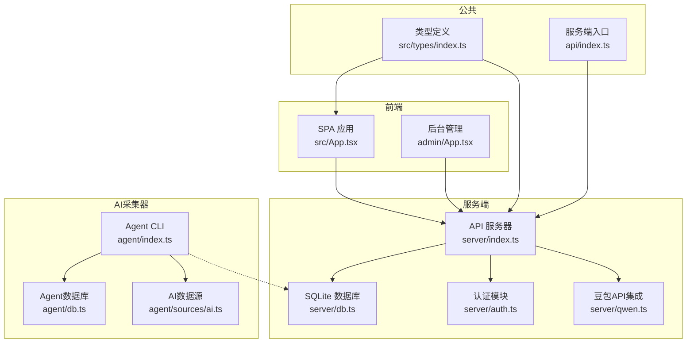
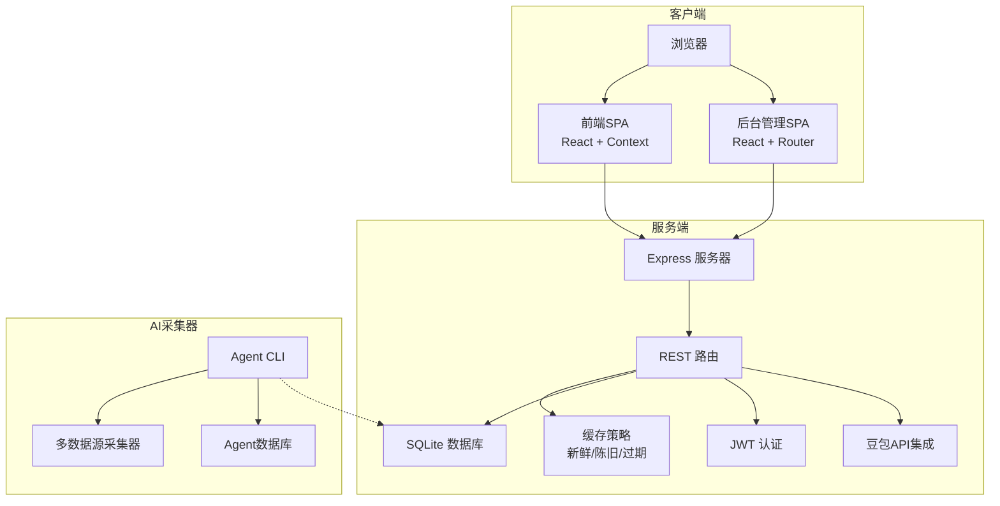
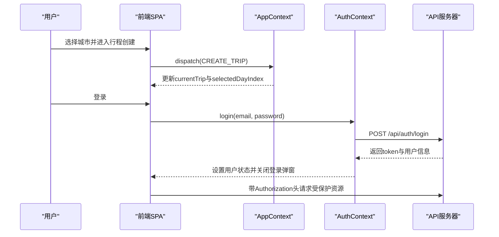
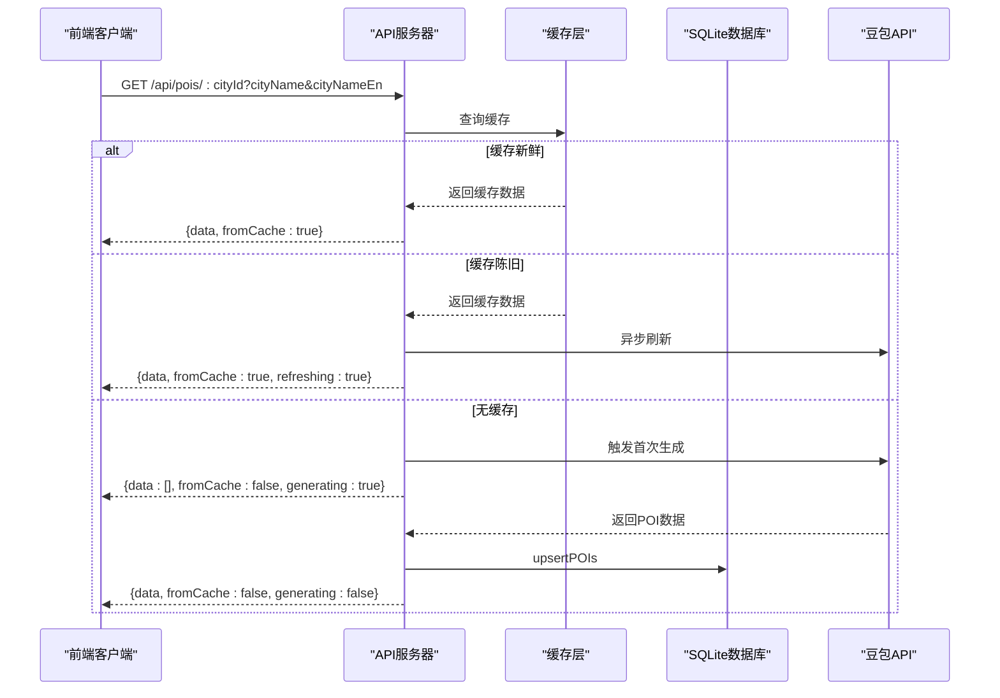
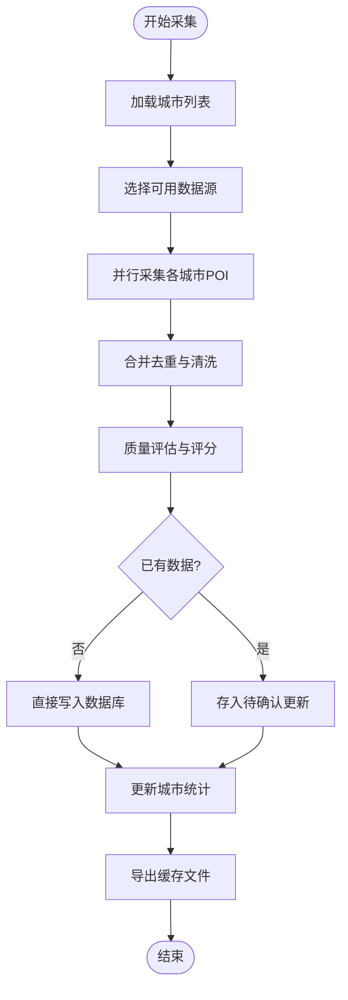
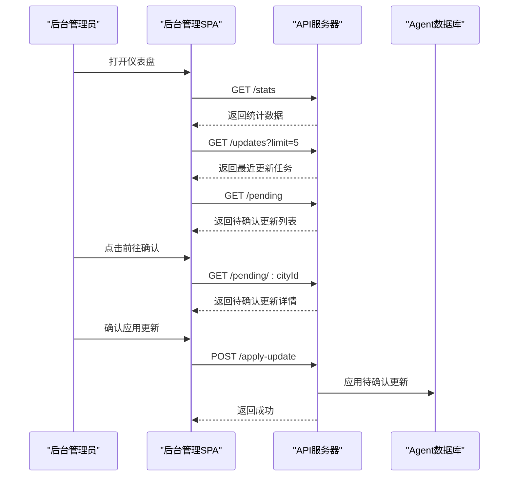
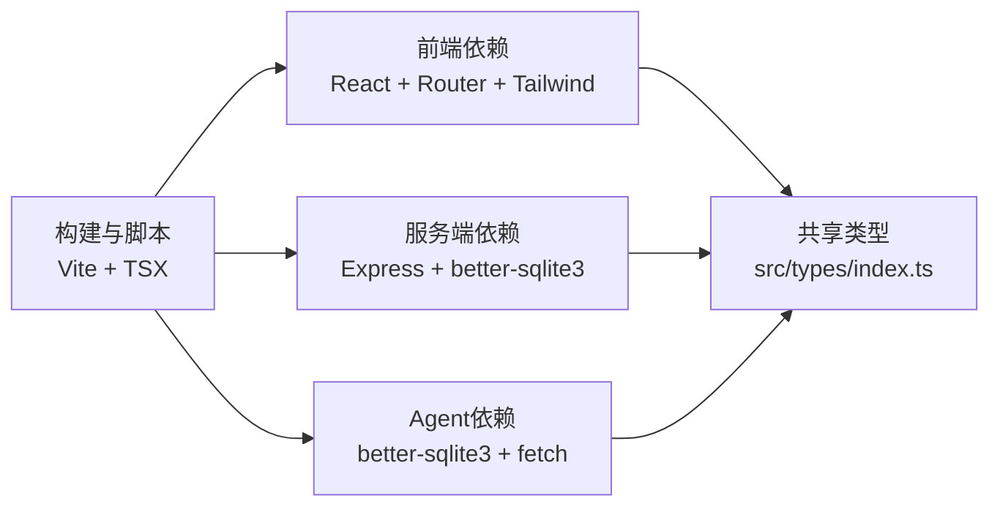

# 系统架构设计

<cite>
**本文档引用的文件**
- [package.json](file://package.json)
- [src/App.tsx](file://src/App.tsx)
- [admin/App.tsx](file://admin/App.tsx)
- [server/index.ts](file://server/index.ts)
- [agent/index.ts](file://agent/index.ts)
- [src/context/AppContext.tsx](file://src/context/AppContext.tsx)
- [src/context/AuthContext.tsx](file://src/context/AuthContext.tsx)
- [server/db.ts](file://server/db.ts)
- [agent/db.ts](file://agent/db.ts)
- [server/auth.ts](file://server/auth.ts)
- [admin/main.tsx](file://admin/main.tsx)
- [src/types/index.ts](file://src/types/index.ts)
- [admin/pages/Dashboard.tsx](file://admin/pages/Dashboard.tsx)
- [src/utils/aiRecommend.ts](file://src/utils/aiRecommend.ts)
- [agent/sources/ai.ts](file://agent/sources/ai.ts)
- [server/qwen.ts](file://server/qwen.ts)
- [api/index.ts](file://api/index.ts)
</cite>

## 目录
1. [引言](#引言)
2. [项目结构](#项目结构)
3. [核心组件](#核心组件)
4. [架构总览](#架构总览)
5. [详细组件分析](#详细组件分析)
6. [依赖关系分析](#依赖关系分析)
7. [性能考虑](#性能考虑)
8. [故障排除指南](#故障排除指南)
9. [结论](#结论)

## 引言
本项目是一个旅行规划Demo，采用前后端分离架构，包含以下主要模块：
- 前端SPA应用：基于React + TypeScript，负责用户交互、状态管理与UI渲染。
- 后台管理系统：独立的React应用，提供数据治理、采集任务监控与审核功能。
- AI数据采集器：独立CLI工具，负责从多数据源采集POI数据，进行合并、去重与质量评估，并将结果导入数据库。
- API服务器：基于Express + SQLite，提供REST接口，支持用户认证、行程管理、游记分享、评论系统与缓存策略。

系统通过清晰的分层设计实现职责分离：前端负责视图与交互；API服务器负责业务逻辑与数据持久化；AI采集器负责离线数据准备；后台管理负责运营与治理。

## 项目结构
项目采用多包/多入口的组织方式：
- 前端SPA应用位于 src/，入口为 src/main.tsx，路由在 src/App.tsx 中定义。
- 后台管理系统位于 admin/，入口为 admin/main.tsx，路由在 admin/App.tsx 中定义。
- API服务器位于 server/，入口为 server/index.ts，提供REST接口。
- AI数据采集器位于 agent/，入口为 agent/index.ts，包含多种数据源采集器与处理逻辑。
- 公共类型定义位于 src/types/index.ts，供前端与API共享。
- 服务端入口文件 api/index.ts 初始化数据库并导出Express应用。

**图表来源**
- [src/App.tsx:1-62](file://src/App.tsx#L1-L62)
- [admin/App.tsx:1-27](file://admin/App.tsx#L1-L27)
- [server/index.ts:1-790](file://server/index.ts#L1-L790)
- [agent/index.ts:1-800](file://agent/index.ts#L1-L800)
- [src/types/index.ts:1-239](file://src/types/index.ts#L1-L239)
- [api/index.ts:1-8](file://api/index.ts#L1-L8)

**章节来源**
- [package.json:1-59](file://package.json#L1-L59)
- [src/App.tsx:1-62](file://src/App.tsx#L1-L62)
- [admin/App.tsx:1-27](file://admin/App.tsx#L1-L27)
- [server/index.ts:1-790](file://server/index.ts#L1-L790)
- [agent/index.ts:1-800](file://agent/index.ts#L1-L800)
- [src/types/index.ts:1-239](file://src/types/index.ts#L1-L239)
- [api/index.ts:1-8](file://api/index.ts#L1-L8)

## 核心组件
- 前端应用上下文
  - AppContext：集中管理应用状态（当前视图、行程数据、预算计算、日程项操作等），通过useReducer实现高效的状态更新与派发。
  - AuthContext：封装认证状态、登录/注册/登出流程、JWT令牌存储与鉴权头生成，提供受保护的API调用能力。
- API服务器
  - 路由层：提供POI查询、酒店查询、用户认证、行程管理、游记分享、评论系统、预订管理等REST接口。
  - 缓存策略：POI与酒店数据采用三层缓存（新鲜/陈旧/过期），结合后台异步刷新，保证首屏快速响应与数据一致性。
  - 安全机制：基于JWT的认证中间件，支持可选认证与必需认证两种模式；密码采用PBKDF2哈希存储。
- AI数据采集器
  - 多源采集：支持OSM、Google、高德、Foursquare、Spark、Doubao等多种数据源，AI作为补充数据源。
  - 数据处理：合并去重、质量评估、增量更新、版本管理与待确认更新队列。
- 后台管理系统
  - 统计面板：展示POI总数、城市覆盖、数据新鲜度分布与最近更新任务。
  - 运营工具：查看待确认更新、待审核发布、批量刷新与质量报告。

**章节来源**
- [src/context/AppContext.tsx:1-234](file://src/context/AppContext.tsx#L1-L234)
- [src/context/AuthContext.tsx:1-218](file://src/context/AuthContext.tsx#L1-L218)
- [server/index.ts:108-160](file://server/index.ts#L108-L160)
- [server/auth.ts:1-133](file://server/auth.ts#L1-L133)
- [agent/index.ts:285-366](file://agent/index.ts#L285-L366)
- [admin/pages/Dashboard.tsx:1-182](file://admin/pages/Dashboard.tsx#L1-L182)

## 架构总览
系统采用“前端SPA + 后端API + AI采集器 + 后台管理”的分层架构：
- 前端层：React SPA与后台管理分别通过路由与上下文进行状态管理与导航。
- 传输层：前后端通过HTTP REST API通信，前端通过AuthContext自动附加认证头。
- 业务层：API服务器封装业务逻辑，包括缓存策略、去重与合并、评论与游记管理、预订流程等。
- 数据层：SQLite数据库，API服务器与Agent各自维护独立数据库，Agent数据库用于采集治理与质量评估。
- AI层：Agent CLI负责离线数据采集与处理，将结果写入API服务器数据库，形成闭环。

**图表来源**
- [server/index.ts:108-160](file://server/index.ts#L108-L160)
- [agent/index.ts:285-366](file://agent/index.ts#L285-L366)
- [server/db.ts:1-513](file://server/db.ts#L1-L513)
- [agent/db.ts:1-459](file://agent/db.ts#L1-L459)

## 详细组件分析

### 前端SPA应用架构
- 视图切换：App.tsx根据AppContext中的currentView动态渲染不同页面组件，支持首页、行程创建、景点详情、个人资料等视图。
- 状态管理：AppContext提供useReducer驱动的状态机，涵盖行程创建、日程项增删改、预算计算、酒店选择等。
- 认证集成：AuthContext提供登录、注册、登出与鉴权头生成，前端API调用统一通过getAuthHeaders注入Authorization头。

**图表来源**
- [src/App.tsx:17-48](file://src/App.tsx#L17-L48)
- [src/context/AppContext.tsx:83-213](file://src/context/AppContext.tsx#L83-L213)
- [src/context/AuthContext.tsx:78-121](file://src/context/AuthContext.tsx#L78-L121)
- [server/index.ts:319-357](file://server/index.ts#L319-L357)

**章节来源**
- [src/App.tsx:1-62](file://src/App.tsx#L1-L62)
- [src/context/AppContext.tsx:1-234](file://src/context/AppContext.tsx#L1-L234)
- [src/context/AuthContext.tsx:1-218](file://src/context/AuthContext.tsx#L1-L218)

### API服务器与缓存策略
- 路由设计：提供POI查询、酒店查询、用户认证、行程管理、游记分享、评论系统、预订管理等REST接口。
- 缓存策略：POI与酒店数据采用三层缓存（新鲜/陈旧/过期），结合后台异步刷新，保证首屏快速响应与数据一致性。
- 安全机制：基于JWT的认证中间件，支持可选认证与必需认证两种模式；密码采用PBKDF2哈希存储。

**图表来源**
- [server/index.ts:108-160](file://server/index.ts#L108-L160)
- [server/db.ts:237-261](file://server/db.ts#L237-L261)
- [server/qwen.ts:361-485](file://server/qwen.ts#L361-L485)

**章节来源**
- [server/index.ts:108-160](file://server/index.ts#L108-L160)
- [server/db.ts:237-261](file://server/db.ts#L237-L261)
- [server/qwen.ts:361-485](file://server/qwen.ts#L361-L485)

### AI数据采集器与数据治理
- 多源采集：支持OSM、Google、高德、Foursquare、Spark、Doubao等多种数据源，AI作为补充数据源。
- 数据处理：合并去重、质量评估、增量更新、版本管理与待确认更新队列。
- 运营工具：后台管理提供统计面板与待确认更新入口，支持批量刷新与质量报告。

**图表来源**
- [agent/index.ts:285-366](file://agent/index.ts#L285-L366)
- [agent/index.ts:218-281](file://agent/index.ts#L218-L281)
- [agent/db.ts:135-150](file://agent/db.ts#L135-L150)

**章节来源**
- [agent/index.ts:1-800](file://agent/index.ts#L1-L800)
- [agent/db.ts:1-459](file://agent/db.ts#L1-L459)

### 后台管理系统
- 统计面板：展示POI总数、城市覆盖、数据新鲜度分布与最近更新任务。
- 运营工具：查看待确认更新、待审核发布、批量刷新与质量报告。
- 路由与入口：admin/main.tsx使用HashRouter，admin/App.tsx定义路由结构。

**图表来源**
- [admin/pages/Dashboard.tsx:19-30](file://admin/pages/Dashboard.tsx#L19-L30)
- [admin/App.tsx:11-26](file://admin/App.tsx#L11-L26)
- [admin/main.tsx:7-13](file://admin/main.tsx#L7-L13)

**章节来源**
- [admin/pages/Dashboard.tsx:1-182](file://admin/pages/Dashboard.tsx#L1-L182)
- [admin/App.tsx:1-27](file://admin/App.tsx#L1-L27)
- [admin/main.tsx:1-14](file://admin/main.tsx#L1-L14)

## 依赖关系分析
- 前端依赖
  - React生态：React、React Router、Framer Motion、TailwindCSS等。
  - 类型定义：src/types/index.ts为前后端共享的类型声明。
- 服务端依赖
  - Express + CORS + Dotenv + better-sqlite3。
  - 认证：JWT签名与验证，PBKDF2密码哈希。
- AI采集器依赖
  - better-sqlite3、fetch、正则修复JSON等。
- 构建与脚本
  - Vite + TSX + 自动化脚本，支持本地开发、构建与Agent命令。

**图表来源**
- [package.json:26-57](file://package.json#L26-L57)
- [src/types/index.ts:1-239](file://src/types/index.ts#L1-L239)

**章节来源**
- [package.json:1-59](file://package.json#L1-L59)
- [src/types/index.ts:1-239](file://src/types/index.ts#L1-L239)

## 性能考虑
- 前端性能
  - 使用React Context与useReducer减少不必要的重渲染，状态变更集中在AppContext中统一处理。
  - 图片懒加载与骨架屏提升首屏体验。
- 服务端性能
  - 缓存策略：新鲜缓存直接返回，陈旧缓存返回旧数据并触发后台刷新，过期缓存异步拉取新数据，避免Nginx超时。
  - 数据库：WAL模式与外键约束优化并发与一致性。
- AI采集器性能
  - 并发采集与限速器，避免API限流与超时。
  - 增量更新与版本管理，减少全量重跑成本。

[本节为通用指导，无需特定文件引用]

## 故障排除指南
- 认证问题
  - 检查JWT密钥与过期时间配置，确认前端AuthContext是否正确设置Authorization头。
- 缓存问题
  - 若出现“无缓存且未配置API Key”，需在环境变量中配置API密钥或等待后台刷新完成。
- 数据库问题
  - 确认DB_DIR与DB_PATH配置，检查SQLite文件权限与磁盘空间。
- AI采集问题
  - 检查数据源可用性与API密钥，查看Agent日志中的错误信息与重试次数。

**章节来源**
- [server/auth.ts:10-11](file://server/auth.ts#L10-L11)
- [server/index.ts:128-131](file://server/index.ts#L128-L131)
- [server/db.ts:18-27](file://server/db.ts#L18-L27)
- [agent/sources/ai.ts:249-251](file://agent/sources/ai.ts#L249-L251)

## 结论
本项目通过清晰的分层架构实现了旅行规划场景下的完整闭环：前端提供优秀的用户体验，API服务器承载业务逻辑与数据持久化，AI采集器负责高质量数据的离线准备，后台管理提供运营与治理能力。缓存策略与增量更新确保了系统的高性能与可扩展性，JWT认证与SQLite数据库提供了基础的安全与可靠性保障。该架构既满足Demo演示需求，也为后续扩展与生产部署奠定了坚实基础。