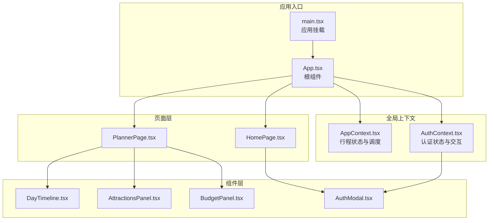
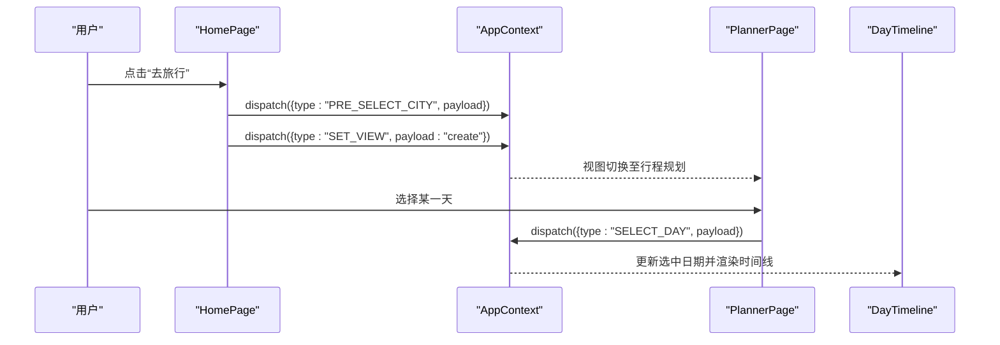
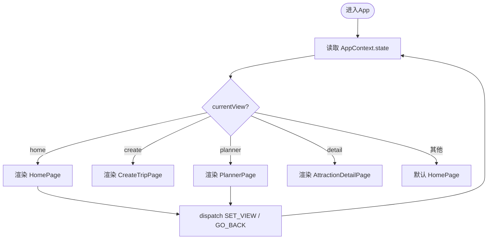
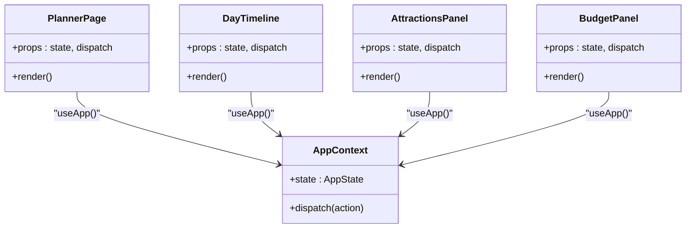
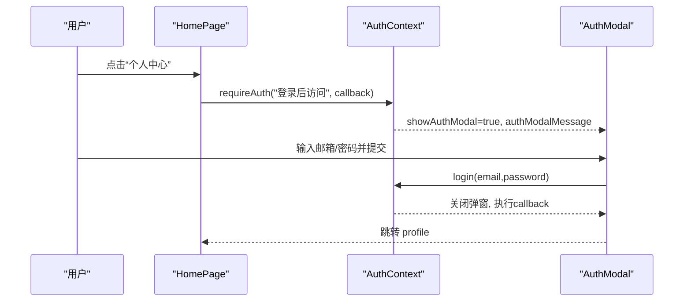
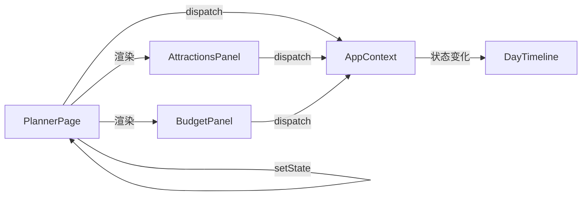
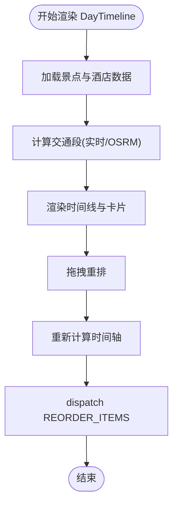
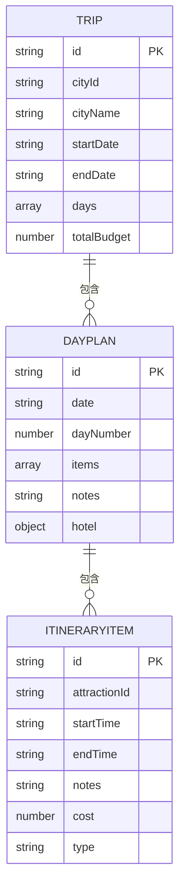
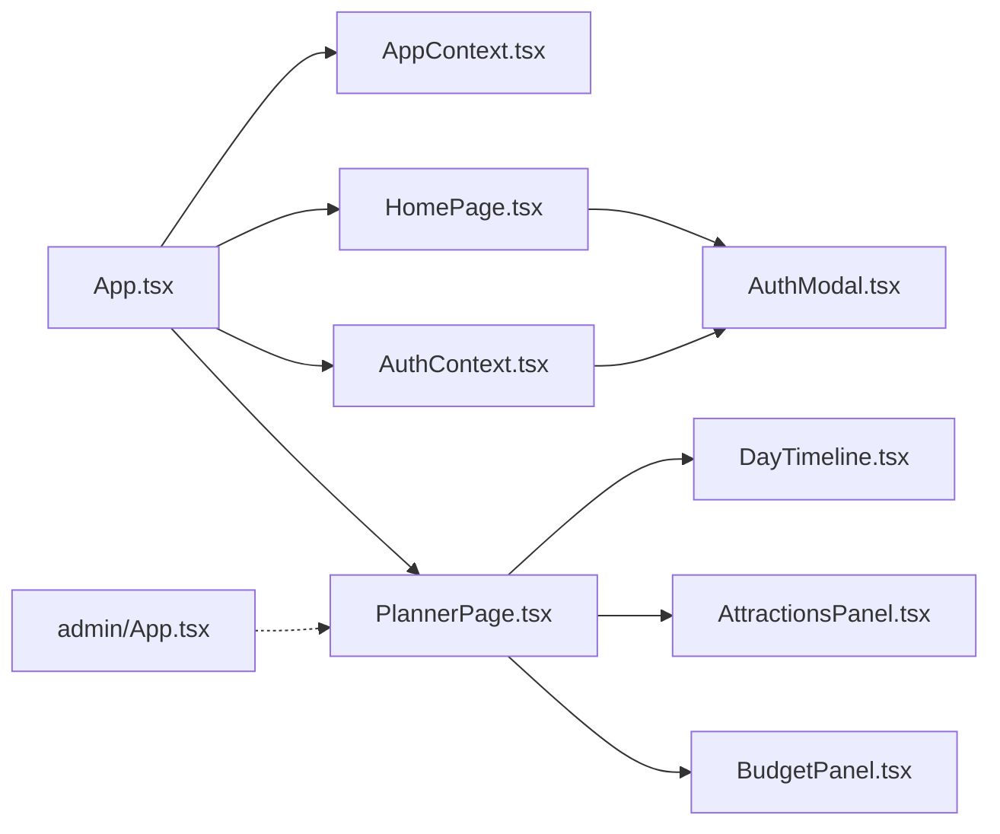

# 组件通信架构

<cite>
**本文引用的文件**
- [src/App.tsx](file://src/App.tsx)
- [src/main.tsx](file://src/main.tsx)
- [src/context/AppContext.tsx](file://src/context/AppContext.tsx)
- [src/context/AuthContext.tsx](file://src/context/AuthContext.tsx)
- [src/components/AuthModal.tsx](file://src/components/AuthModal.tsx)
- [src/pages/HomePage.tsx](file://src/pages/HomePage.tsx)
- [src/pages/PlannerPage.tsx](file://src/pages/PlannerPage.tsx)
- [src/components/AttractionsPanel.tsx](file://src/components/AttractionsPanel.tsx)
- [src/components/BudgetPanel.tsx](file://src/components/BudgetPanel.tsx)
- [src/components/DayTimeline.tsx](file://src/components/DayTimeline.tsx)
- [src/types/index.ts](file://src/types/index.ts)
- [admin/App.tsx](file://admin/App.tsx)
</cite>

## 目录
1. [简介](#简介)
2. [项目结构](#项目结构)
3. [核心组件](#核心组件)
4. [架构总览](#架构总览)
5. [详细组件分析](#详细组件分析)
6. [依赖关系分析](#依赖关系分析)
7. [性能考量](#性能考量)
8. [故障排查指南](#故障排查指南)
9. [结论](#结论)
10. [附录](#附录)

## 简介
本文件面向旅行规划Demo项目的前端组件通信架构，系统性阐述React组件间通信模式与状态共享机制，覆盖父子组件通信、兄弟组件通信、跨层级通信；解释Context API的使用方式与状态共享策略；总结事件处理与回调设计模式；说明自定义Hook的使用与逻辑复用；梳理组件生命周期与副作用处理；并给出最佳实践与性能优化建议。文中所有分析均基于仓库现有源码，配合可视化图示帮助读者快速建立整体认知。

## 项目结构
项目采用“按功能域分层”的组织方式：
- 应用入口与路由：src/main.tsx、src/App.tsx
- 页面与组件：src/pages、src/components
- 全局状态：src/context（AppContext、AuthContext）
- 类型定义：src/types
- 管理后台：admin（独立路由与页面）

**图表来源**
- [src/main.tsx:1-10](file://src/main.tsx#L1-L10)
- [src/App.tsx:1-62](file://src/App.tsx#L1-L62)
- [src/context/AppContext.tsx:1-234](file://src/context/AppContext.tsx#L1-L234)
- [src/context/AuthContext.tsx:1-218](file://src/context/AuthContext.tsx#L1-L218)
- [src/pages/HomePage.tsx:1-688](file://src/pages/HomePage.tsx#L1-L688)
- [src/pages/PlannerPage.tsx:1-388](file://src/pages/PlannerPage.tsx#L1-L388)
- [src/components/DayTimeline.tsx:1-979](file://src/components/DayTimeline.tsx#L1-L979)
- [src/components/AttractionsPanel.tsx:1-298](file://src/components/AttractionsPanel.tsx#L1-L298)
- [src/components/BudgetPanel.tsx:1-134](file://src/components/BudgetPanel.tsx#L1-L134)
- [src/components/AuthModal.tsx:1-141](file://src/components/AuthModal.tsx#L1-L141)

**章节来源**
- [src/main.tsx:1-10](file://src/main.tsx#L1-L10)
- [src/App.tsx:1-62](file://src/App.tsx#L1-L62)

## 核心组件
- App与视图切换：App.tsx通过AppContext的状态决定当前渲染的页面，实现“视图栈”式导航与回退。
- 行程状态管理：AppContext.tsx以useReducer集中管理行程数据、当前视图、选中日期、景点面板开关等。
- 认证与授权：AuthContext.tsx管理用户登录态、Token存储、鉴权弹窗触发与API请求头注入。
- 页面与组件：PlannerPage作为主流程页面，组合DayTimeline、AttractionsPanel、BudgetPanel；HomePage负责目的地检索与导航；AuthModal统一处理登录/注册。

**章节来源**
- [src/App.tsx:17-48](file://src/App.tsx#L17-L48)
- [src/context/AppContext.tsx:43-54](file://src/context/AppContext.tsx#L43-L54)
- [src/context/AuthContext.tsx:45-211](file://src/context/AuthContext.tsx#L45-L211)
- [src/pages/PlannerPage.tsx:15-54](file://src/pages/PlannerPage.tsx#L15-L54)
- [src/pages/HomePage.tsx:26-120](file://src/pages/HomePage.tsx#L26-L120)
- [src/components/AuthModal.tsx:9-19](file://src/components/AuthModal.tsx#L9-L19)

## 架构总览
本项目采用“上下文驱动 + 页面组件编排”的架构：
- 上下文层：AppContext提供行程级状态；AuthContext提供认证级状态。
- 页面层：PlannerPage、HomePage等作为容器组件，消费上下文并向下传递回调。
- 组件层：DayTimeline、AttractionsPanel、BudgetPanel等展示组件通过dispatch修改状态或触发导航。

**图表来源**
- [src/pages/HomePage.tsx:75-80](file://src/pages/HomePage.tsx#L75-L80)
- [src/context/AppContext.tsx:83-212](file://src/context/AppContext.tsx#L83-L212)
- [src/pages/PlannerPage.tsx:150-181](file://src/pages/PlannerPage.tsx#L150-L181)
- [src/components/DayTimeline.tsx:49-80](file://src/components/DayTimeline.tsx#L49-L80)

## 详细组件分析

### App与视图切换（跨层级通信）
- AppContent根据AppContext.state.currentView进行条件渲染，实现“视图栈”式导航。
- 支持“上一步”返回：previousView用于记录前一视图，GO_BACK动作恢复历史视图或默认首页。
- 与AuthModal配合：登录弹窗在任意页面可被触发，登录成功后执行回调（如跳转个人中心）。

**图表来源**
- [src/App.tsx:17-48](file://src/App.tsx#L17-L48)
- [src/context/AppContext.tsx:83-212](file://src/context/AppContext.tsx#L83-L212)

**章节来源**
- [src/App.tsx:17-48](file://src/App.tsx#L17-L48)
- [src/context/AppContext.tsx:83-212](file://src/context/AppContext.tsx#L83-L212)

### 行程状态与调度（父子/跨层级通信）
- AppContext以useReducer集中管理行程数据（Trip、DayPlan、ItineraryItem），提供统一的Action类型与reducer。
- PlannerPage作为父容器，向子组件传递dispatch与状态片段（如selectedDayIndex）。
- DayTimeline、AttractionsPanel、BudgetPanel通过dispatch修改行程数据（增删改、排序、设置酒店、计算预算等）。

**图表来源**
- [src/context/AppContext.tsx:215-233](file://src/context/AppContext.tsx#L215-L233)
- [src/pages/PlannerPage.tsx:15-23](file://src/pages/PlannerPage.tsx#L15-L23)
- [src/components/DayTimeline.tsx:49-58](file://src/components/DayTimeline.tsx#L49-L58)
- [src/components/AttractionsPanel.tsx:23-32](file://src/components/AttractionsPanel.tsx#L23-L32)
- [src/components/BudgetPanel.tsx:5-8](file://src/components/BudgetPanel.tsx#L5-L8)

**章节来源**
- [src/context/AppContext.tsx:22-42](file://src/context/AppContext.tsx#L22-L42)
- [src/context/AppContext.tsx:83-212](file://src/context/AppContext.tsx#L83-L212)
- [src/pages/PlannerPage.tsx:15-54](file://src/pages/PlannerPage.tsx#L15-L54)

### 认证上下文与弹窗（跨层级通信）
- AuthContext提供登录/注册/登出、鉴权弹窗控制、API请求头注入等能力。
- AuthModal作为独立弹窗组件，监听AuthContext状态并在用户完成登录后执行回调。
- HomePage在访问受限功能时调用requireAuth，若未登录则弹窗提示并缓存回调。

**图表来源**
- [src/pages/HomePage.tsx:69-73](file://src/pages/HomePage.tsx#L69-L73)
- [src/context/AuthContext.tsx:128-137](file://src/context/AuthContext.tsx#L128-L137)
- [src/components/AuthModal.tsx:20-33](file://src/components/AuthModal.tsx#L20-L33)

**章节来源**
- [src/context/AuthContext.tsx:45-211](file://src/context/AuthContext.tsx#L45-L211)
- [src/components/AuthModal.tsx:9-19](file://src/components/AuthModal.tsx#L9-L19)
- [src/pages/HomePage.tsx:69-80](file://src/pages/HomePage.tsx#L69-L80)

### 景点面板与预算面板（兄弟组件通信）
- PlannerPage通过状态控制侧边栏面板的显隐与标签页切换（景点推荐/预算管理）。
- AttractionsPanel与BudgetPanel均为纯展示组件，通过dispatch修改AppContext状态，实现兄弟组件间“间接通信”（共享状态）。

**图表来源**
- [src/pages/PlannerPage.tsx:18-22](file://src/pages/PlannerPage.tsx#L18-L22)
- [src/pages/PlannerPage.tsx:250-286](file://src/pages/PlannerPage.tsx#L250-L286)
- [src/components/AttractionsPanel.tsx:23-32](file://src/components/AttractionsPanel.tsx#L23-L32)
- [src/components/BudgetPanel.tsx:5-8](file://src/components/BudgetPanel.tsx#L5-L8)

**章节来源**
- [src/pages/PlannerPage.tsx:18-22](file://src/pages/PlannerPage.tsx#L18-L22)
- [src/pages/PlannerPage.tsx:250-286](file://src/pages/PlannerPage.tsx#L250-L286)
- [src/components/AttractionsPanel.tsx:23-32](file://src/components/AttractionsPanel.tsx#L23-L32)
- [src/components/BudgetPanel.tsx:5-8](file://src/components/BudgetPanel.tsx#L5-L8)

### 时间线与拖拽重排（复杂交互）
- DayTimeline负责渲染当日行程、计算路线、支持拖拽重排与一键优化。
- 通过useEffect拉取实时交通信息，通过useMemo缓存计算结果，减少重渲染。
- 拖拽过程中动态计算新时间轴并批量更新，保证连续时间段的合理性。

**图表来源**
- [src/components/DayTimeline.tsx:98-124](file://src/components/DayTimeline.tsx#L98-L124)
- [src/components/DayTimeline.tsx:243-276](file://src/components/DayTimeline.tsx#L243-L276)
- [src/context/AppContext.tsx:125-130](file://src/context/AppContext.tsx#L125-L130)

**章节来源**
- [src/components/DayTimeline.tsx:49-80](file://src/components/DayTimeline.tsx#L49-L80)
- [src/components/DayTimeline.tsx:98-124](file://src/components/DayTimeline.tsx#L98-L124)
- [src/components/DayTimeline.tsx:243-276](file://src/components/DayTimeline.tsx#L243-L276)

### 类型与数据模型
- types/index.ts定义了行程、日程、POI、酒店、用户等核心类型，确保上下文与组件间的数据契约一致。
- AppContext中的Action与reducer严格约束对状态的变更路径，避免脏写。

**图表来源**
- [src/types/index.ts:125-134](file://src/types/index.ts#L125-L134)
- [src/types/index.ts:116-123](file://src/types/index.ts#L116-L123)
- [src/types/index.ts:102-114](file://src/types/index.ts#L102-L114)

**章节来源**
- [src/types/index.ts:1-239](file://src/types/index.ts#L1-L239)
- [src/context/AppContext.tsx:22-42](file://src/context/AppContext.tsx#L22-L42)

## 依赖关系分析
- 组件依赖：PlannerPage依赖AppContext与AuthContext；DayTimeline依赖AppContext与AuthContext；AttractionsPanel与BudgetPanel依赖AppContext。
- 路由与后台：admin/App.tsx提供独立后台路由，与前端业务解耦。

**图表来源**
- [src/App.tsx:1-62](file://src/App.tsx#L1-L62)
- [src/context/AppContext.tsx:1-234](file://src/context/AppContext.tsx#L1-L234)
- [src/context/AuthContext.tsx:1-218](file://src/context/AuthContext.tsx#L1-L218)
- [src/pages/HomePage.tsx:1-688](file://src/pages/HomePage.tsx#L1-L688)
- [src/pages/PlannerPage.tsx:1-388](file://src/pages/PlannerPage.tsx#L1-L388)
- [src/components/DayTimeline.tsx:1-979](file://src/components/DayTimeline.tsx#L1-L979)
- [src/components/AttractionsPanel.tsx:1-298](file://src/components/AttractionsPanel.tsx#L1-L298)
- [src/components/BudgetPanel.tsx:1-134](file://src/components/BudgetPanel.tsx#L1-L134)
- [src/components/AuthModal.tsx:1-141](file://src/components/AuthModal.tsx#L1-L141)
- [admin/App.tsx:1-27](file://admin/App.tsx#L1-L27)

**章节来源**
- [src/App.tsx:1-62](file://src/App.tsx#L1-L62)
- [admin/App.tsx:1-27](file://admin/App.tsx#L1-L27)

## 性能考量
- 状态粒度与不可变更新：AppContext通过useReducer集中更新，避免深层嵌套对象的浅比较失效；reducer内部深拷贝关键字段，确保不可变更新。
- 计算缓存：HomePage使用useMemo缓存搜索结果、分组数据；DayTimeline使用useMemo缓存POI映射，减少重复计算。
- 副作用最小化：AuthContext在mount时一次性检查Token；DayTimeline仅在关键依赖变化时请求交通数据。
- 渲染优化：AttractionsPanel与BudgetPanel通过useMemo过滤与排序，减少列表重渲染；DayTimeline在拖拽时仅局部更新时间轴。
- 事件节流/防抖：可结合自定义Hook（如useDebounce）对高频输入进行节流，降低渲染压力（注：仓库未直接提供该Hook，可在后续扩展）。

[本节为通用性能指导，不直接分析具体文件，故无“章节来源”]

## 故障排查指南
- 登录弹窗不消失：检查AuthContext的closeAuthModal是否被正确调用；确认回调队列在登录成功后被清空。
- 保存行程失败：检查doSaveTrip中的requireAuth与getAuthHeaders是否生效；确认后端接口返回success字段。
- 拖拽重排异常：检查handleDrop中的索引计算与时间轴重排逻辑；确保dispatch的REORDER_ITEMS payload顺序正确。
- 预算统计不准确：核对AppContext的recalcBudget与各Action对totalBudget的更新路径。

**章节来源**
- [src/context/AuthContext.tsx:139-141](file://src/context/AuthContext.tsx#L139-L141)
- [src/pages/PlannerPage.tsx:26-52](file://src/pages/PlannerPage.tsx#L26-L52)
- [src/components/DayTimeline.tsx:249-276](file://src/components/DayTimeline.tsx#L249-L276)
- [src/context/AppContext.tsx:77-81](file://src/context/AppContext.tsx#L77-L81)

## 结论
本项目通过AppContext与AuthContext实现了清晰的跨层级状态共享，配合useReducer与useMemo等手段，既保证了状态一致性，又兼顾了性能与可维护性。PlannerPage作为容器组件，将复杂的交互拆分为多个职责单一的子组件，形成高内聚低耦合的组件体系。建议在后续迭代中引入自定义Hook（如useDebounce）进一步优化高频输入场景，并完善错误边界与加载态提示，提升用户体验。

## 附录
- 最佳实践清单
  - 使用useContext只暴露必要的状态片段，避免过度订阅。
  - 将昂贵计算放入useMemo/useCallback，减少不必要渲染。
  - 通过Action枚举与reducer集中更新，保持状态变更可追踪。
  - 对外暴露的组件尽量无副作用，通过props与回调进行交互。
  - 对API调用进行统一拦截与错误处理，避免组件内散落重复逻辑。

[本节为通用指导，不直接分析具体文件，故无“章节来源”]