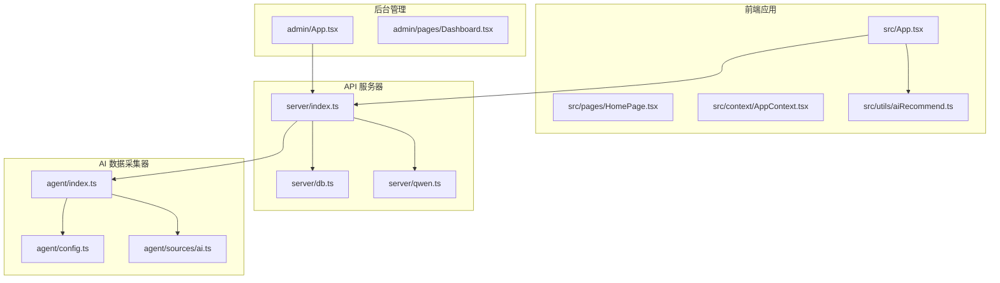
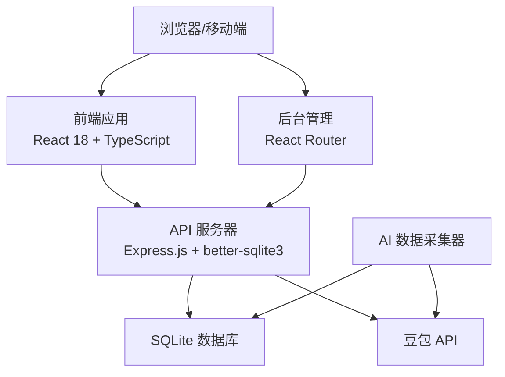
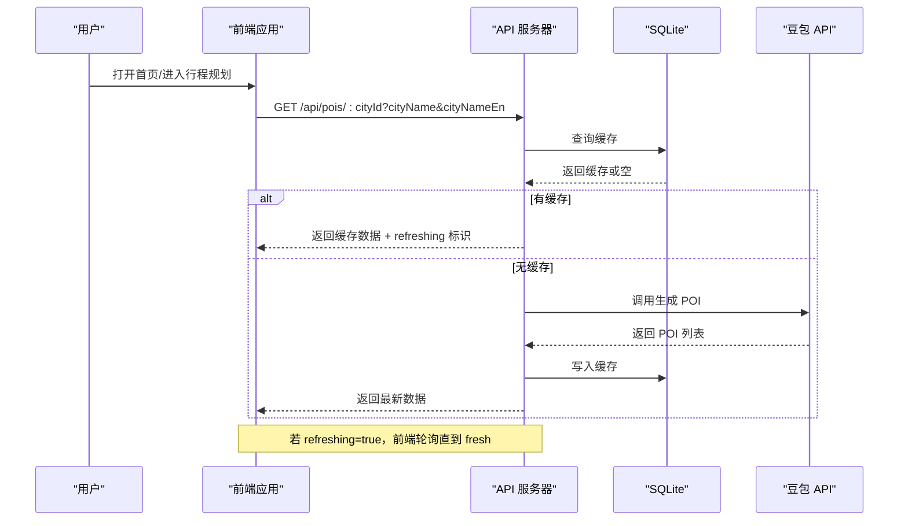
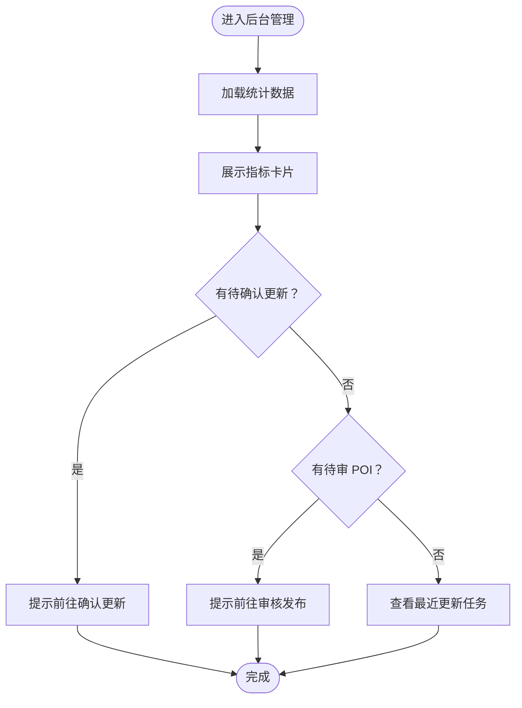
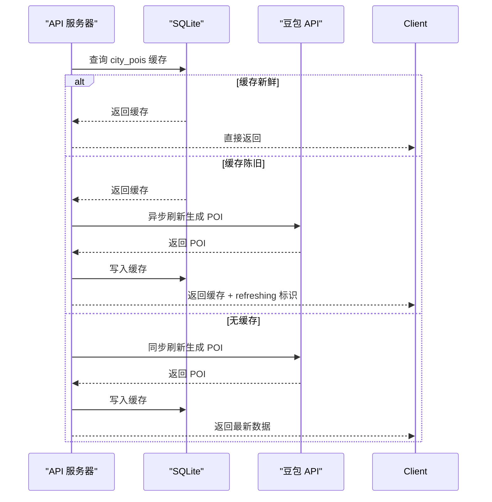
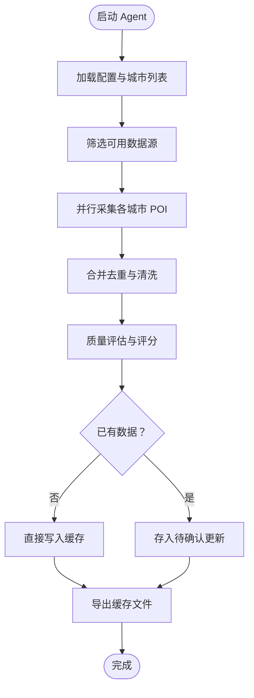
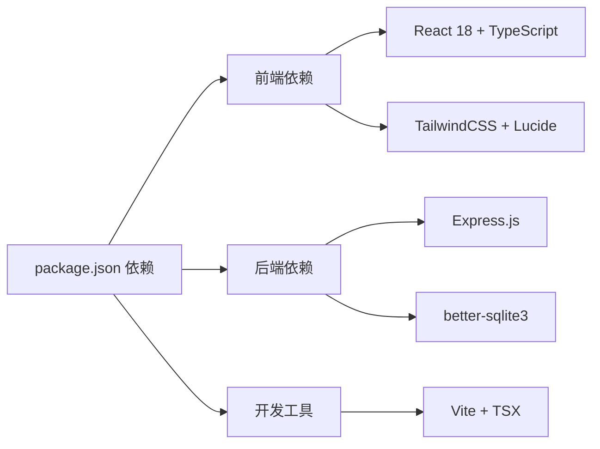

# 项目概述

<cite>
**本文档引用的文件**
- [package.json](file://package.json)
- [src/App.tsx](file://src/App.tsx)
- [src/pages/HomePage.tsx](file://src/pages/HomePage.tsx)
- [src/context/AppContext.tsx](file://src/context/AppContext.tsx)
- [src/types/index.ts](file://src/types/index.ts)
- [src/utils/aiRecommend.ts](file://src/utils/aiRecommend.ts)
- [admin/App.tsx](file://admin/App.tsx)
- [admin/pages/Dashboard.tsx](file://admin/pages/Dashboard.tsx)
- [server/index.ts](file://server/index.ts)
- [server/db.ts](file://server/db.ts)
- [server/qwen.ts](file://server/qwen.ts)
- [agent/index.ts](file://agent/index.ts)
- [agent/config.ts](file://agent/config.ts)
- [agent/sources/ai.ts](file://agent/sources/ai.ts)
- [api/index.ts](file://api/index.ts)
</cite>

## 目录
1. [引言](#引言)
2. [项目结构](#项目结构)
3. [核心组件](#核心组件)
4. [架构总览](#架构总览)
5. [详细组件分析](#详细组件分析)
6. [依赖关系分析](#依赖关系分析)
7. [性能考虑](#性能考虑)
8. [故障排查指南](#故障排查指南)
9. [结论](#结论)
10. [附录](#附录)

## 引言
本项目是一个基于 React 18 + TypeScript + Express.js + SQLite 技术栈构建的智能旅行规划 Demo。系统通过 AI 驱动的 POI 推荐、多源数据采集与实时地图展示，帮助用户高效规划旅行行程。项目采用前后端分离架构，前端提供用户交互界面与行程管理能力，后端提供 API 服务与数据缓存，AI Agent 负责离线/定时采集与数据治理，形成“前端体验 + 后端服务 + AI 数据采集”的协同体系。

## 项目结构
项目采用多模块组织方式，包含前端应用、后台管理系统、API 服务器、AI 数据采集器以及脚本工具链：

- 前端应用（src/）：基于 React 18 + TypeScript，提供首页、行程规划、景点详情、游记分享等功能页面与上下文管理。
- 后台管理系统（admin/）：基于 React Router 的管理界面，提供数据统计、更新任务、待审 POI 等管理能力。
- API 服务器（server/）：基于 Express.js + better-sqlite3，提供 POI、酒店、用户、行程、评论等接口与缓存策略。
- AI 数据采集器（agent/）：独立 CLI 工具，从多数据源采集 POI，进行合并去重与质量评估，最终写入缓存。
- 核心 API 入口（api/index.ts）：统一导出 Express 应用，便于部署与冷启动初始化数据库。

图表来源
- [src/App.tsx:1-62](file://src/App.tsx#L1-L62)
- [src/pages/HomePage.tsx:1-688](file://src/pages/HomePage.tsx#L1-L688)
- [src/context/AppContext.tsx:1-234](file://src/context/AppContext.tsx#L1-L234)
- [src/utils/aiRecommend.ts:1-251](file://src/utils/aiRecommend.ts#L1-L251)
- [admin/App.tsx:1-27](file://admin/App.tsx#L1-L27)
- [admin/pages/Dashboard.tsx:1-182](file://admin/pages/Dashboard.tsx#L1-L182)
- [server/index.ts:1-790](file://server/index.ts#L1-L790)
- [server/db.ts:1-513](file://server/db.ts#L1-L513)
- [server/qwen.ts:1-486](file://server/qwen.ts#L1-L486)
- [agent/index.ts:1-800](file://agent/index.ts#L1-L800)
- [agent/config.ts:1-182](file://agent/config.ts#L1-L182)
- [agent/sources/ai.ts:1-342](file://agent/sources/ai.ts#L1-L342)
- [api/index.ts:1-8](file://api/index.ts#L1-L8)

章节来源
- [package.json:1-59](file://package.json#L1-L59)
- [src/App.tsx:1-62](file://src/App.tsx#L1-L62)
- [admin/App.tsx:1-27](file://admin/App.tsx#L1-L27)
- [server/index.ts:1-790](file://server/index.ts#L1-L790)
- [agent/index.ts:1-800](file://agent/index.ts#L1-L800)
- [api/index.ts:1-8](file://api/index.ts#L1-L8)

## 核心组件
- 前端应用（React 18 + TypeScript）
  - 应用入口与视图路由：根据 AppContext 状态切换页面，支持首页、行程创建、景点详情、游记等视图。
  - 上下文管理：集中管理行程、选中地点、当前日期、预选城市等状态，支持视图切换与数据联动。
  - AI 推荐客户端：封装 POI 获取与轮询刷新逻辑，屏蔽服务端缓存策略细节。
- 后台管理系统（React Router）
  - 管理员仪表盘：展示 POI 总数、城市数、覆盖类目、最近更新、数据新鲜度分布、待审与待确认更新等。
  - 任务与更新：查看最近更新任务、待审 POI、待确认更新等。
- API 服务器（Express.js + better-sqlite3）
  - 数据缓存：POI 与酒店数据采用三层缓存策略（新鲜/近期/陈旧），支持首次生成与后台刷新。
  - 用户与行程：提供用户注册/登录、行程保存/发布/评论等完整能力。
  - AI 集成：对接豆包（Doubao）API 生成 POI，支持去重与质量评估。
- AI 数据采集器（Agent）
  - 多源采集：支持 OSM、高德、谷歌、Foursquare、通义千问、讯飞星火、豆包等数据源。
  - 数据治理：合并去重、质量评估、增量更新、待审机制，确保数据一致性与可追溯性。
- 核心 API 入口
  - 统一导出 Express 应用，负责数据库初始化与静态资源托管。

章节来源
- [src/App.tsx:1-62](file://src/App.tsx#L1-L62)
- [src/context/AppContext.tsx:1-234](file://src/context/AppContext.tsx#L1-L234)
- [src/utils/aiRecommend.ts:1-251](file://src/utils/aiRecommend.ts#L1-L251)
- [admin/pages/Dashboard.tsx:1-182](file://admin/pages/Dashboard.tsx#L1-L182)
- [server/index.ts:1-790](file://server/index.ts#L1-L790)
- [server/db.ts:1-513](file://server/db.ts#L1-L513)
- [server/qwen.ts:1-486](file://server/qwen.ts#L1-L486)
- [agent/index.ts:1-800](file://agent/index.ts#L1-L800)
- [agent/config.ts:1-182](file://agent/config.ts#L1-L182)
- [api/index.ts:1-8](file://api/index.ts#L1-L8)

## 架构总览
系统采用“前端 SPA + 后端 API + AI Agent”三层协作架构：
- 前端通过 /api 接口获取 POI 与酒店数据，结合本地上下文与轮询机制实现流畅体验。
- 后端提供统一 API，内部集成缓存与去重策略，保障响应速度与数据质量。
- AI Agent 独立运行，周期性/按需采集多源数据，写入本地缓存，供后端快速返回。

图表来源
- [server/index.ts:1-790](file://server/index.ts#L1-L790)
- [server/db.ts:1-513](file://server/db.ts#L1-L513)
- [server/qwen.ts:1-486](file://server/qwen.ts#L1-L486)
- [agent/index.ts:1-800](file://agent/index.ts#L1-L800)

## 详细组件分析

### 前端应用（React 18 + TypeScript）
- 视图路由与状态管理
  - App.tsx 根据 AppContext.state.currentView 渲染不同页面，支持首页、行程创建、景点详情、游记等。
  - AppContext 提供行程创建、天数选择、项目增删改、酒店设置、详情页切换等动作。
- 首页与目的地推荐
  - HomePage 提供搜索框、热门标签、国内国际目的地卡片、字母索引与国家展开等交互。
- AI 推荐客户端
  - aiRecommend.ts 封装 loadPOIRecommendations 与 forceRefreshPOIs，处理缓存命中、后台刷新轮询与错误处理。

图表来源
- [src/App.tsx:1-62](file://src/App.tsx#L1-L62)
- [src/utils/aiRecommend.ts:1-251](file://src/utils/aiRecommend.ts#L1-L251)
- [server/index.ts:1-790](file://server/index.ts#L1-L790)
- [server/db.ts:1-513](file://server/db.ts#L1-L513)
- [server/qwen.ts:1-486](file://server/qwen.ts#L1-L486)

章节来源
- [src/App.tsx:1-62](file://src/App.tsx#L1-L62)
- [src/pages/HomePage.tsx:1-688](file://src/pages/HomePage.tsx#L1-L688)
- [src/context/AppContext.tsx:1-234](file://src/context/AppContext.tsx#L1-L234)
- [src/utils/aiRecommend.ts:1-251](file://src/utils/aiRecommend.ts#L1-L251)

### 后台管理系统（Admin）
- 仪表盘概览
  - Dashboard 展示 POI 总数、城市数、覆盖类目、最近更新、数据新鲜度分布、待审与待确认更新等。
- 更新与审核
  - 支持查看最近更新任务、待审 POI、待确认更新，引导管理员完成数据治理闭环。

图表来源
- [admin/pages/Dashboard.tsx:1-182](file://admin/pages/Dashboard.tsx#L1-L182)
- [admin/App.tsx:1-27](file://admin/App.tsx#L1-L27)

章节来源
- [admin/pages/Dashboard.tsx:1-182](file://admin/pages/Dashboard.tsx#L1-L182)
- [admin/App.tsx:1-27](file://admin/App.tsx#L1-L27)

### API 服务器（Express.js + better-sqlite3）
- 缓存策略
  - POI 与酒店采用三层缓存：15 天内直接返回；15–30 天返回缓存并触发后台刷新；超过 30 天则先刷新再返回。
- 用户与行程
  - 提供注册/登录、行程保存/发布/评论、评论开关、游记列表与详情等完整能力。
- AI 集成
  - 调用豆包 API 生成 POI，支持去重与质量评估，写入缓存供前端轮询刷新。

图表来源
- [server/index.ts:1-790](file://server/index.ts#L1-L790)
- [server/db.ts:1-513](file://server/db.ts#L1-L513)
- [server/qwen.ts:1-486](file://server/qwen.ts#L1-L486)

章节来源
- [server/index.ts:1-790](file://server/index.ts#L1-L790)
- [server/db.ts:1-513](file://server/db.ts#L1-L513)
- [server/qwen.ts:1-486](file://server/qwen.ts#L1-L486)

### AI 数据采集器（Agent）
- 多源采集与治理
  - 支持 OSM、高德、谷歌、Foursquare、通义千问、讯飞星火、豆包等数据源，按可用性动态启用。
  - 采集后执行合并去重、质量评估、增量更新与待审机制，最终写入缓存。
- 配置与调度
  - 通过 .env.local 配置 API Key 与运行参数，支持并发城市数、超时与速率限制等。
  - 自动决策增量/全量刷新，按城市热度与数据新鲜度选择优先级。

图表来源
- [agent/index.ts:1-800](file://agent/index.ts#L1-L800)
- [agent/config.ts:1-182](file://agent/config.ts#L1-L182)
- [agent/sources/ai.ts:1-342](file://agent/sources/ai.ts#L1-L342)

章节来源
- [agent/index.ts:1-800](file://agent/index.ts#L1-L800)
- [agent/config.ts:1-182](file://agent/config.ts#L1-L182)
- [agent/sources/ai.ts:1-342](file://agent/sources/ai.ts#L1-L342)

### 类型与数据模型
- 关键类型
  - HotelPOI、Attraction、ItineraryItem、DayPlan、Trip、User、TravelNote、Comment、MicroNote 等，支撑行程、酒店、POI、评论与游记等业务实体。
- 前后端数据映射
  - 前端通过 aiRecommend.ts 将服务端返回的 POI 数据转换为 Attraction 接口，保证类型安全与字段一致性。

章节来源
- [src/types/index.ts:1-239](file://src/types/index.ts#L1-L239)
- [src/utils/aiRecommend.ts:208-238](file://src/utils/aiRecommend.ts#L208-L238)

## 依赖关系分析
- 前端依赖
  - React 18、React Router、TailwindCSS、Framer Motion、Leaflet/React-Leaflet 等，提供现代化 UI 与地图展示能力。
- 后端依赖
  - Express、better-sqlite3、dotenv、cors 等，提供高性能 API 与轻量数据库。
- 开发与构建
  - Vite、TypeScript、tsx、PostCSS/Tailwind 等，支持快速开发与热更新。

图表来源
- [package.json:26-57](file://package.json#L26-L57)

章节来源
- [package.json:1-59](file://package.json#L1-L59)

## 性能考虑
- 前端性能
  - 使用 React 18 的并发特性与 Suspense 优化，减少重渲染；图片懒加载与骨架屏提升首屏体验。
- 后端性能
  - SQLite WAL 模式与外键约束优化读写性能；三层缓存策略降低冷启动与高并发下的 API 延迟。
  - 服务端异步刷新避免 Nginx 超时，前端轮询等待新鲜数据。
- AI 采集性能
  - 并发采集与速率限制平衡吞吐与稳定性；增量更新减少全量扫描成本。

## 故障排查指南
- 常见问题
  - 无 API Key：后端在无缓存时会返回 NO_API_KEY 错误，需配置豆包 API Key。
  - 缓存未刷新：若 refreshing=true，前端会轮询直至 fresh；若长时间未刷新，检查后端日志与豆包 API 可用性。
  - 数据源不可用：Agent 会自动检测数据源可用性，未配置 Key 的源会被跳过。
- 排查步骤
  - 检查 .env.local 中 API Key 是否正确。
  - 查看后端日志与数据库文件路径（DB_DIR）。
  - 使用 Agent 的 status/quality 命令检查采集状态与质量评分。
  - 通过 Admin 仪表盘查看待审与待确认更新数量。

章节来源
- [server/index.ts:108-160](file://server/index.ts#L108-L160)
- [agent/index.ts:538-639](file://agent/index.ts#L538-L639)
- [agent/config.ts:87-125](file://agent/config.ts#L87-L125)

## 结论
本项目通过“前端体验 + 后端服务 + AI 数据采集”的协同设计，实现了从目的地发现、智能推荐到行程落地的一体化旅行规划方案。React 18 + TypeScript 提供稳定高效的前端体验，Express.js + SQLite 保障后端性能与易部署，AI Agent 则确保数据的持续更新与高质量。项目具备良好的扩展性与可维护性，适合进一步拓展至多语言、多币种与更丰富的旅行场景。

## 附录
- 项目脚本
  - dev/dev: 前端开发与服务端开发联跑
  - build/build: 前端构建与服务端编译
  - agent:*: AI 数据采集相关命令（collect/reprocess/export/quality/status/sources/refresh）
  - admin: 后台管理开发
- 部署建议
  - 生产环境建议使用持久化存储（DB_DIR）与反向代理（Nginx/PM2/Vercel），并配置环境变量与 API Key。

章节来源
- [package.json:6-25](file://package.json#L6-L25)