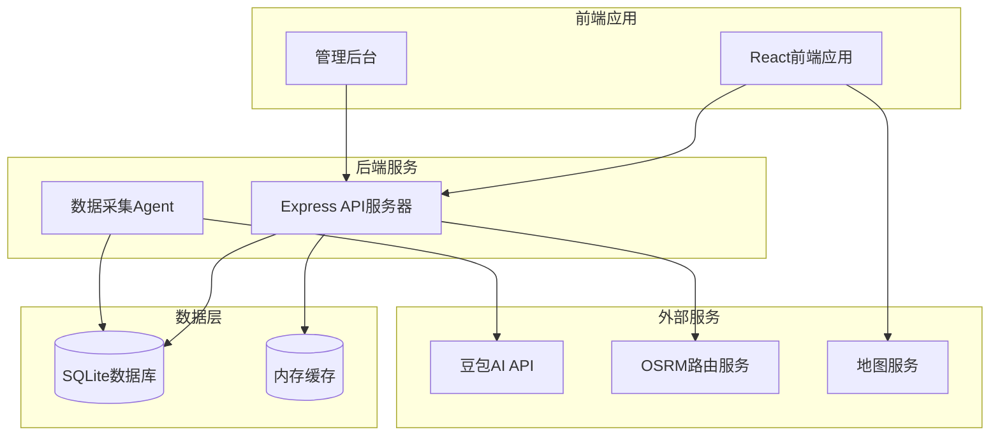
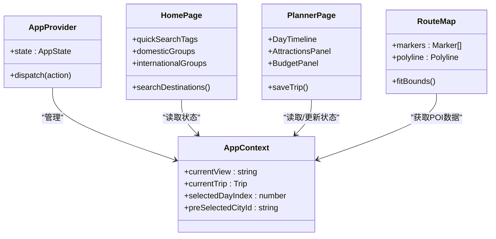
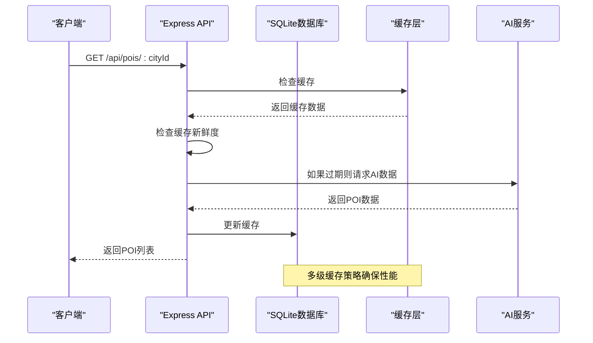
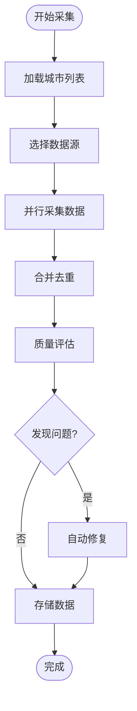
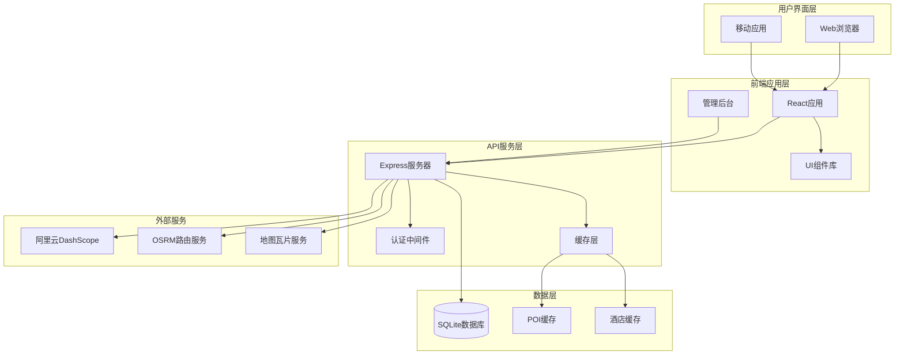
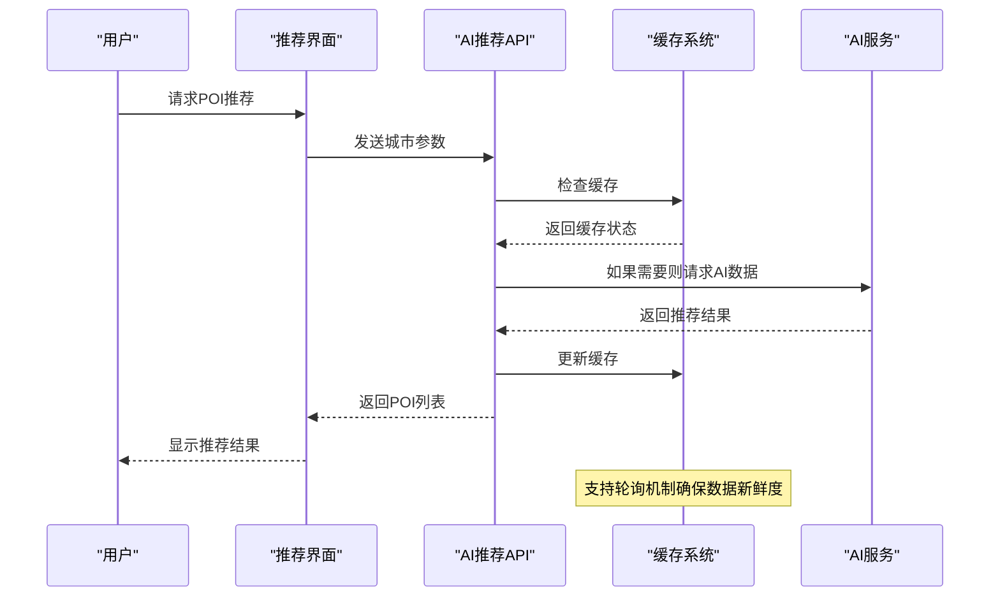
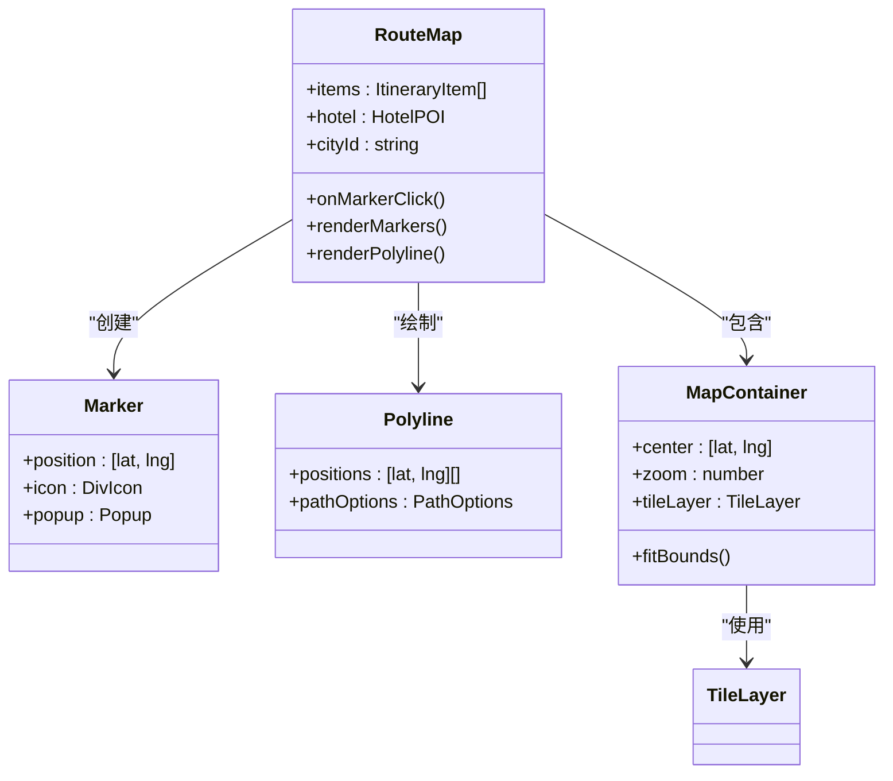
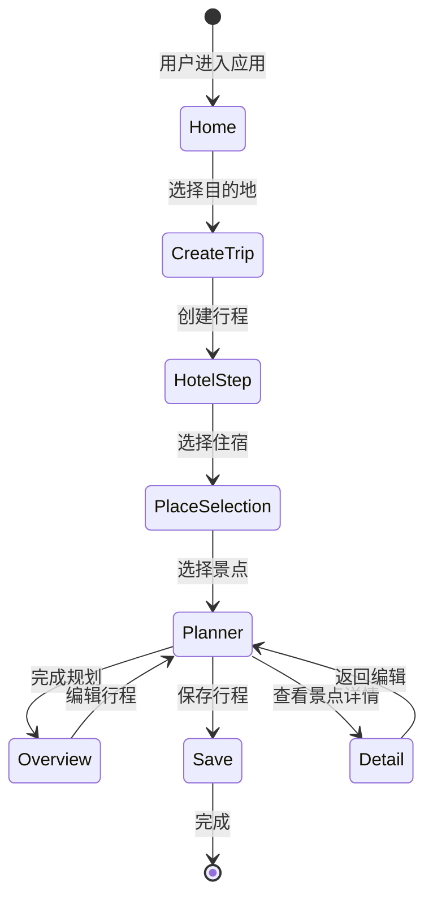
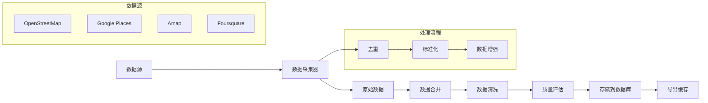

# 项目简介

<cite>
**本文档引用的文件**
- [package.json](file://package.json)
- [src/App.tsx](file://src/App.tsx)
- [admin/App.tsx](file://admin/App.tsx)
- [server/index.ts](file://server/index.ts)
- [agent/index.ts](file://agent/index.ts)
- [src/pages/HomePage.tsx](file://src/pages/HomePage.tsx)
- [src/pages/PlannerPage.tsx](file://src/pages/PlannerPage.tsx)
- [src/components/RouteMap.tsx](file://src/components/RouteMap.tsx)
- [src/utils/aiRecommend.ts](file://src/utils/aiRecommend.ts)
- [src/context/AppContext.tsx](file://src/context/AppContext.tsx)
- [server/db.ts](file://server/db.ts)
- [agent/db.ts](file://agent/db.ts)
- [src/types/index.ts](file://src/types/index.ts)
- [vercel.json](file://vercel.json)
- [render.yaml](file://render.yaml)
- [ecosystem.config.cjs](file://ecosystem.config.cjs)
</cite>

## 目录
1. [项目概述](#项目概述)
2. [项目结构](#项目结构)
3. [核心组件](#核心组件)
4. [架构概览](#架构概览)
5. [详细组件分析](#详细组件分析)
6. [依赖关系分析](#依赖关系分析)
7. [性能考量](#性能考量)
8. [故障排除指南](#故障排除指南)
9. [结论](#结论)
10. [附录](#附录)

## 项目概述

智游旅行是一个基于AI驱动的智能旅行规划系统，旨在为用户提供个性化、智能化的旅行规划体验。该项目通过整合多源数据、AI推荐算法和实时地图展示，帮助用户轻松制定完美的旅行行程。

### 核心目标与愿景
- **智能化旅行规划**：利用AI技术为用户提供个性化的景点推荐和行程安排
- **一站式旅行解决方案**：从目的地选择到行程执行的完整旅行体验
- **数据驱动的决策支持**：基于真实数据和用户反馈优化旅行建议
- **实时互动体验**：提供流畅的用户交互和实时的地图导航功能

### 应用场景与价值
- **个人旅行规划**：为个人或小团体提供定制化旅行方案
- **商务出行**：为企业团队提供高效的商务旅行规划工具
- **旅游产品开发**：为旅行社和旅游平台提供智能推荐引擎
- **城市营销**：帮助城市和景区提升游客吸引力和满意度

### 主要功能特性
- **AI驱动的POI推荐**：基于用户偏好和实时数据的智能景点推荐
- **多源数据采集**：整合多家数据源的丰富POI信息
- **实时地图展示**：集成Leaflet地图，提供直观的路线规划
- **用户交互系统**：完整的用户认证、行程管理和社交分享功能
- **智能预算管理**：自动计算和优化旅行预算
- **微游记功能**：旅行过程中的实时记录和分享

### 技术创新与优势
- **现代化技术栈**：React 18 + TypeScript + Express.js + SQLite的高效组合
- **智能缓存策略**：多层次缓存机制确保响应速度和数据新鲜度
- **增量数据更新**：支持数据的持续更新和版本管理
- **跨平台部署**：支持Vercel、Render等多种部署方式
- **前后端分离**：清晰的架构分离便于维护和扩展

## 项目结构

项目采用模块化架构设计，分为前端应用、管理后台、API服务和数据采集四个主要部分：



**图表来源**
- [src/App.tsx:1-62](file://src/App.tsx#L1-L62)
- [admin/App.tsx:1-27](file://admin/App.tsx#L1-L27)
- [server/index.ts:1-790](file://server/index.ts#L1-L790)
- [agent/index.ts:1-800](file://agent/index.ts#L1-L800)

### 核心模块划分
- **前端应用** (`src/`): 用户界面和交互逻辑
- **管理后台** (`admin/`): 内容管理和数据治理
- **API服务** (`server/`): 后端服务和业务逻辑
- **数据采集** (`agent/`): 自动化数据收集和处理
- **脚本工具** (`scripts/`): 辅助工具和数据处理

**章节来源**
- [package.json:1-59](file://package.json#L1-L59)
- [src/App.tsx:1-62](file://src/App.tsx#L1-L62)
- [admin/App.tsx:1-27](file://admin/App.tsx#L1-L27)

## 核心组件

### 前端应用架构

项目采用React 18构建用户界面，通过Context API实现全局状态管理，提供响应式的旅行规划体验。



**图表来源**
- [src/context/AppContext.tsx:1-234](file://src/context/AppContext.tsx#L1-L234)
- [src/pages/HomePage.tsx:1-688](file://src/pages/HomePage.tsx#L1-L688)
- [src/pages/PlannerPage.tsx:1-388](file://src/pages/PlannerPage.tsx#L1-L388)
- [src/components/RouteMap.tsx:1-180](file://src/components/RouteMap.tsx#L1-L180)

### API服务架构

后端采用Express.js构建RESTful API，使用SQLite作为数据存储，实现了完整的旅行规划功能。



**图表来源**
- [server/index.ts:108-160](file://server/index.ts#L108-L160)
- [server/db.ts:1-200](file://server/db.ts#L1-L200)

### 数据采集系统

Agent模块负责自动化数据收集，支持多源数据整合和质量控制。



**图表来源**
- [agent/index.ts:285-366](file://agent/index.ts#L285-L366)
- [agent/index.ts:218-281](file://agent/index.ts#L218-L281)

**章节来源**
- [src/context/AppContext.tsx:1-234](file://src/context/AppContext.tsx#L1-L234)
- [server/index.ts:1-790](file://server/index.ts#L1-L790)
- [agent/index.ts:1-800](file://agent/index.ts#L1-L800)

## 架构概览

项目采用现代全栈架构，结合前端SPA、后端API和自动化数据采集系统。



**图表来源**
- [package.json:26-42](file://package.json#L26-L42)
- [server/index.ts:29-53](file://server/index.ts#L29-L53)
- [vercel.json:1-6](file://vercel.json#L1-L6)

### 技术栈优势
- **React 18**: 提供最新的并发特性和性能优化
- **TypeScript**: 增强类型安全和开发体验
- **Express.js**: 轻量级、灵活的后端框架
- **SQLite**: 轻量级、无需配置的数据库
- **Leaflet**: 强大的开源地图库
- **Tailwind CSS**: 实用优先的CSS框架

**章节来源**
- [package.json:1-59](file://package.json#L1-L59)
- [vercel.json:1-6](file://vercel.json#L1-L6)
- [render.yaml:1-12](file://render.yaml#L1-L12)

## 详细组件分析

### 智能POI推荐系统

AI推荐系统是项目的核心功能之一，通过多源数据融合和智能算法为用户提供个性化的旅行建议。



**图表来源**
- [src/utils/aiRecommend.ts:44-94](file://src/utils/aiRecommend.ts#L44-L94)
- [src/utils/aiRecommend.ts:170-205](file://src/utils/aiRecommend.ts#L170-L205)

#### 推荐算法特点
- **多源数据融合**: 整合来自不同数据源的POI信息
- **智能排序**: 基于用户偏好和实时因素进行排序
- **季节性考虑**: 考虑季节因素对景点推荐的影响
- **质量保证**: 通过质量评估确保推荐结果的准确性

**章节来源**
- [src/utils/aiRecommend.ts:1-251](file://src/utils/aiRecommend.ts#L1-L251)
- [server/index.ts:108-160](file://server/index.ts#L108-L160)

### 实时地图展示系统

集成Leaflet地图库，提供直观的旅行路线规划和POI展示功能。



**图表来源**
- [src/components/RouteMap.tsx:79-180](file://src/components/RouteMap.tsx#L79-L180)

#### 地图功能特性
- **动态标记**: 根据行程自动添加和更新标记
- **路线绘制**: 连接酒店和景点形成完整路线
- **交互式导航**: 支持点击标记查看详情
- **自适应布局**: 响应式设计适配不同设备

**章节来源**
- [src/components/RouteMap.tsx:1-180](file://src/components/RouteMap.tsx#L1-L180)

### 用户行程管理系统

提供完整的旅行行程创建、编辑和管理功能。



**图表来源**
- [src/pages/HomePage.tsx:75-80](file://src/pages/HomePage.tsx#L75-L80)
- [src/pages/PlannerPage.tsx:15-52](file://src/pages/PlannerPage.tsx#L15-L52)

#### 行程管理功能
- **多天行程**: 支持多天的详细行程规划
- **预算跟踪**: 实时计算和跟踪旅行预算
- **酒店管理**: 集成酒店选择和预订功能
- **微游记**: 旅行过程中的实时记录和分享

**章节来源**
- [src/pages/PlannerPage.tsx:1-388](file://src/pages/PlannerPage.tsx#L1-L388)
- [src/context/AppContext.tsx:1-234](file://src/context/AppContext.tsx#L1-L234)

### 数据采集与管理

Agent系统负责自动化数据收集、处理和质量控制。



**图表来源**
- [agent/index.ts:115-130](file://agent/index.ts#L115-L130)
- [agent/index.ts:218-281](file://agent/index.ts#L218-L281)

#### 数据处理特点
- **并行采集**: 支持多数据源同时采集
- **智能去重**: 自动识别和去除重复数据
- **质量控制**: 多维度的质量评估和验证
- **增量更新**: 支持数据的持续更新和版本管理

**章节来源**
- [agent/index.ts:1-800](file://agent/index.ts#L1-L800)
- [agent/db.ts:1-200](file://agent/db.ts#L1-L200)

## 依赖关系分析

项目采用模块化设计，各组件间依赖关系清晰，便于维护和扩展。

```mermaid
graph TD
subgraph "前端依赖"
React[react@18.3.1]
TS[typescript]
Tailwind[tailwindcss]
Leaflet[react-leaflet]
end
subgraph "后端依赖"
Express[express@5.2.1]
BetterSQL[better-sqlite3@12.8.0]
Cors[cors@2.8.6]
Dotenv[dotenv@17.3.1]
end
subgraph "开发依赖"
Vite[vite@6.0.5]
TSX[tsx@4.21.0]
PostCSS[postcss@8.4.49]
Autoprefixer[autoprefixer@10.4.20]
end
React --> Leaflet
Express --> BetterSQL
Vite --> TSX
PostCSS --> Autoprefixer
```

**图表来源**
- [package.json:26-57](file://package.json#L26-L57)

### 核心依赖说明
- **前端运行时依赖**: React生态系统提供用户界面基础
- **后端运行时依赖**: Express.js提供API服务，SQLite存储数据
- **开发工具依赖**: Vite提供开发服务器，TypeScript提供类型安全

**章节来源**
- [package.json:1-59](file://package.json#L1-L59)

## 性能考量

项目在设计时充分考虑了性能优化，采用了多种策略确保良好的用户体验。

### 缓存策略
- **多级缓存**: 服务器端缓存 + 前端缓存的双重保护
- **智能刷新**: 过期数据的后台异步刷新机制
- **数据新鲜度**: 15天内新数据直接返回，15-30天触发后台刷新

### 性能优化措施
- **懒加载**: 图片和组件的按需加载
- **虚拟滚动**: 大列表的高性能渲染
- **防抖节流**: 输入框和搜索的性能优化
- **CDN加速**: 静态资源的CDN分发

## 故障排除指南

### 常见问题及解决方案

#### API服务启动问题
- **症状**: 服务无法启动或端口占用
- **原因**: 端口冲突或环境变量配置错误
- **解决**: 检查PORT环境变量，确保端口可用

#### 数据库连接问题
- **症状**: 数据库初始化失败
- **原因**: 文件权限或路径配置问题
- **解决**: 检查DB_DIR环境变量和目录权限

#### AI服务集成问题
- **症状**: POI推荐失败或超时
- **原因**: API密钥配置或网络连接问题
- **解决**: 验证DASHSCOPE_API_KEY配置

**章节来源**
- [server/index.ts:778-787](file://server/index.ts#L778-L787)
- [server/db.ts:37-45](file://server/db.ts#L37-L45)

## 结论

智游旅行项目通过先进的技术架构和智能化的功能设计，为用户提供了完整的旅行规划解决方案。项目采用现代化的技术栈，具备良好的可扩展性和维护性。

### 项目优势总结
- **技术创新**: AI驱动的智能推荐和多源数据融合
- **用户体验**: 流畅的界面交互和实时的地图展示
- **技术先进**: 基于React 18 + TypeScript + Express.js + SQLite的现代化组合
- **部署灵活**: 支持多种部署方式，易于扩展和维护

### 发展前景
项目为旅行行业数字化转型提供了优秀的参考案例，具有广阔的市场应用前景和发展空间。

## 附录

### 部署配置示例

#### Vercel部署配置
```json
{
  "rewrites": [
    { "source": "/api/(.*)", "destination": "/api" }
  ]
}
```

#### Render部署配置
```yaml
services:
  - type: web
    name: aitrip-planner
    runtime: node
    buildCommand: npm install && npm run build
    startCommand: npm start
    envVars:
      - key: NODE_ENV
        value: production
      - key: DASHSCOPE_API_KEY
        sync: false
```

#### PM2部署配置
```javascript
module.exports = {
  apps: [{
    name: 'aitrip',
    script: 'npm',
    args: 'start',
    cwd: '/opt/aitrip',
    env: {
      NODE_ENV: 'production',
      PORT: 3001
    }
  }]
}
```

**章节来源**
- [vercel.json:1-6](file://vercel.json#L1-L6)
- [render.yaml:1-12](file://render.yaml#L1-L12)
- [ecosystem.config.cjs:1-17](file://ecosystem.config.cjs#L1-L17)